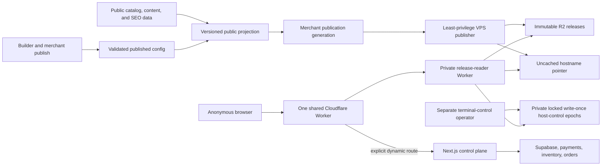

# Baci Multi-Tenant Edge Storefront Delivery Implementation Plan

> **Status:** Revision 11, upgraded on 2026-08-08 against `origin/main@20aa5c3652e87190c18ca023b31030f61aa8d580`. Execute each task as a separately reviewed PR unless a task explicitly says it is an operational evidence step. This plan does not authorize production mutations, Cloudflare provisioning, a `proxy.ts` change, or a new privileged database boundary by itself.

**Goal:** Remove eligible anonymous storefront browsing from Vercel for Baci's builder-generated storefronts, then Ogabassey's custom-coded theme, by publishing immutable merchant releases to private R2 and serving them through one shared public Cloudflare Worker plus one shared private reader Worker. Preserve each merchant's AI-generated or manually edited design; keep checkout, accounts, payments, orders, inventory validation, quiz, repairs, and other stateful commerce operations authoritative and dynamic.

**Business outcome:** Reduce the actual net hosting bill, not merely improve a cache-hit metric. Before infrastructure work, prove that eligible storefront browsing is a material Vercel billed cost through provider-authenticated, SKU-reconciled attribution rather than a caller-supplied dollar estimate. After rollout, prove at least 99.9% origin avoidance for eligible requests and a measured reduction in Vercel billed usage that exceeds the higher of Cloudflare's incremental cash impact and fully allocated cost. A seven-day normalized-usage result may gate rollout, but the plan does not claim an actual invoice reduction until complete finalized post-rollout Vercel and Cloudflare billing periods reconcile with the controlled usage counterfactual.

**Relationship to the older plan:** [`2026-07-27-ultra-low-cost-storefront-delivery.md`](./2026-07-27-ultra-low-cost-storefront-delivery.md) remains the historical Ogabassey evidence and security design. This plan replaces its **single-merchant-first rollout decision** with a generic release plane and a builder-contract-first pilot. Reuse its implemented evidence contracts and fail-closed operational lessons; do not carry forward its assumption that other merchants remain permanently on Vercel.

## Decision Summary

1. Build one multi-tenant release plane for Baci: one public serving Worker, one private reader Worker, one release bucket, one tiny separately authorized terminal-control bucket, and no server or code deployment per merchant.
2. Pilot the deterministic Baci builder/Puck publication contract first because its component vocabulary and persisted output are controlled and reusable. This is not one visual theme: AI and merchants may compose distinct layouts, content, brand tokens, and supported component props. Use a synthetic fixture before enrolling one consenting, low-risk builder-contract merchant.
3. Add Ogabassey second through a dedicated renderer adapter because it is a custom theme. Ogabassey is the high-traffic savings canary, not the architecture template.
4. Store only public, published, bounded storefront data in immutable release objects. Drafts, customer data, credentials, private inventory controls, and provider responses never enter R2.
5. Serve known anonymous `GET`/`HEAD` browsing routes at the edge. Forward only explicitly classified dynamic routes to the unchanged application with method, body, query, cookies, `Origin`, and CSRF semantics preserved.
6. Keep the current Vercel/Supabase commerce control plane during the release-plane rollout. Decide whether remaining dynamic workloads move to the VPS or AWS only after the post-rollout bill shows what remains.
7. Do not set the whole Next.js application to `output: 'export'`. Next.js static export does not support request-dependent cookies, Proxy, rewrites, ISR, or Server Actions. Build a dedicated deterministic release renderer for the eligible route set instead.
8. Use Cloudflare for SaaS for merchant custom-hostname/TLS onboarding only after the exact-host pilots and a provider-authenticated per-host dynamic-origin contract are proven. A wildcard Worker route bypasses per-host `custom_origin_server`, so an active hostname's `request.cf.hostMetadata` must carry the complete bounded, signed, versioned, non-secret enrollment/origin profile that the Worker validates before either edge selection or origin forwarding; an opaque unresolved profile ID, unknown/inactive host, or schema/signature mismatch terminates without origin access. This keeps dynamic forwarding independent of R2, a database lookup, and per-merchant Worker deployment. Do not adopt Workers for Platforms unless Baci later permits merchants to execute arbitrary custom code; one shared public serving Worker is sufficient for the current product.
9. Keep both R2 buckets private. Use one additional unrouted, service-bound release-reader Worker so the reviewed public serving build has no direct R2 binding or arbitrary-key surface. Cloudflare RPC requires a default handler, so bind the caller to a named reader entrypoint and make the required default `fetch` a constant terminal `404` that cannot access either binding. RPC methods return only schema-validated by-value DTOs or bounded streams, never functions, stubs, `RpcTarget` instances, bindings, or other callable capabilities. The reader deployment authority remains a high-trust R2-capable root because it can replace that code; named entrypoints and bundle tests constrain reviewed code, not a compromised deployer. This is still one shared multi-tenant serving plane, not per-merchant infrastructure.
10. Treat a storefront view as the complete browser request waterfall, not only the document request. An eligible passive browse is not origin-free if delayed analytics, component hydration, Supabase, image optimization, or same-origin API requests still reach Vercel.
11. Make terminal control monotonic under an explicit Cloudflare governance trust boundary. Each enrolled hostname references one canonical append-only terminal epoch chain. Genesis, disable, route-tombstone, and predecessor-seal records are write-once, signed, and protected from ordinary overwrite/deletion by provider-read-back R2 bucket locks. A predecessor seal selects exactly one successor epoch ID and genesis hash; the reader rejects an orphan/forked successor, a pointer to a sealed non-head epoch, or a successor not selected by its predecessor seal. Cloudflare permits a sufficiently privileged administrator to remove a lock rule, so account super-administrators and the offline lock administrator are declared trusted roots, monitored separately, and never described as cryptographically prevented from tampering. Clearing an override advances that unique chain and never deletes or overwrites prior evidence.
12. For the synthetic and first real pilot, emit no passive browser page-view request. Require explicit merchant/owner acceptance of that temporary analytics gap. Cohort expansion requires a separately reviewed edge-safe analytics policy or continued explicit opt-out; authoritative conversion and commerce events stay dynamic.

## Current PR and Mainline Impact

| Change | Effect on this plan | Required response |
| --- | --- | --- |
| Open PR #3279, provider-neutral builder editing | Architecturally compatible. At the 2026-08-08 exact-head snapshot (`2fb0d0760c65119f0db6036ab06c4ee9f8213b62`) it is `OPEN` and GitHub reports `BLOCKED`; that mutable PR state is not a release-plane dependency. | Publisher reads the persisted, validated `page_configs.published_config`; it never accepts an AI/provider response as a release input. A draft AI edit causes no release until the merchant publishes it. Re-read its final merged component catalog before Task 1B. |
| Open PR #3280, guarded Vercel attestation bootstrap | Architecturally compatible and not a release-plane dependency. At the 2026-08-08 exact-head snapshot (`63f91afeab0680cbf621e0b3ca8b4a67778848bd`) it remains stacked on #3279's branch rather than `main`; it is disabled by default, production-only, and temporary. | Exclude the bootstrap route and all attestation secrets from static output. Complete its documented cleanup independently; do not treat it as permanent storefront runtime. Recheck live PR state rather than relying on this snapshot. |
| Merged PR #3283, stale-production-promotion guard | Provides a current-main deployment-authority foundation, but its path predicate protects the existing web/Vercel target rather than the not-yet-created edge targets. | Task 5 extracts/reuses the fail-closed GitHub ref/compare authority without weakening the web guard, adds an edge-specific affected-path predicate, and rechecks it before every reader/public upload and every traffic-weight or route promotion attempt. |
| Merged PR #3266, deterministic curated defaults | Direct fallback foundation for the builder-contract pilot. | Reuse `storefront-defaults` only when a builder merchant has no custom published homepage; never replace a valid AI-generated or merchant-edited `published_config`. |
| Merged PR #3269, SEO/canonical parity | Adds mandatory release acceptance behavior. | Release output must match canonical, robots, sitemap, metadata, structured-data, and public-image eligibility contracts. |
| Merged PR #3260, unsafe storefront path rejection | Defines security and canonicalization behavior that the Worker must not contradict. | Create one shared, testable edge route contract and prove parity with current path behavior. Do not modify `apps/web/src/proxy.ts` without fresh explicit approval. |
| Merged PR #3282, production live quiz | Confirms that quiz is live, authenticated, and time-sensitive. | Keep `/quiz` and every `/api/quiz/**` request on the dynamic control plane. |
| Merged PR #3274, storefront order schema repair | Confirms order creation is database-authoritative. | Checkout and order creation always reach the current backend and recompute price, stock, promotion, shipping, tax, and final amount. |
| Merged PR #3250, Ogabassey origin contract | Provides reusable evidence and origin-budget primitives. | Generalize the manifest inventory to a cohort/merchant scope while preserving exact traffic partitions and fail-closed `NOT_PROVEN`. |
| GIGL/VPS cron cost work, including PR #3275 | Orthogonal and compatible. | Treat it as background-runtime savings; do not couple it to storefront release serving or expand its database authority. |

**Conclusion:** #3279 and #3280 do not block, invalidate, or materially overlap the edge-delivery architecture. Recent mainline work does affect the implementation contract: the current builder schema, component catalog, AI draft pipeline, and `published_config` are the primary release source; #3266 supplies only the no-custom-config fallback; #3269, #3260, #3282, and #3274 define hard parity and dynamic-boundary requirements; and #3283 makes target-aware current-main authority mandatory for every edge upload and promotion.

## Target Architecture



### Release layout

Use one production release bucket with tenant-separated immutable keys:

```text
hosts/{normalized-hostname}.json
merchants/{merchant-id}/releases/{release-id}/manifest.json
merchants/{merchant-id}/releases/{release-id}/pages/{route-hash}.html
merchants/{merchant-id}/releases/{release-id}/assets/{content-hash}.{ext}
renderers/{renderer-version}/assets/{content-hash}.{ext}
```

Use a separate private terminal-control bucket with immutable, strongly consistent epoch records per hostname:

```text
controls/hosts/{normalized-hostname}/epochs/{epoch-id}/genesis.json
controls/hosts/{normalized-hostname}/epochs/{epoch-id}/disabled.json
controls/hosts/{normalized-hostname}/epochs/{epoch-id}/tombstones/{route-hash}.json
controls/hosts/{normalized-hostname}/epochs/{epoch-id}/seal.json
```

- A release-bucket hostname pointer contains `schemaVersion`, normalized hostname, merchant ID, mode (`origin` or `edge`), monotonically increasing publication generation, immutable release ID, manifest key/hash, activation time, terminal epoch ID, and signed genesis hash.
- Every edge activation requires a terminal-signed epoch genesis. A root genesis has no predecessor. Every non-root genesis names its predecessor epoch/genesis and is eligible only when the predecessor's signed write-once seal selects that exact successor epoch ID and genesis hash. The reader rejects a missing, malformed, cross-host, orphaned, forked, rollback, or hash-mismatched genesis with a bounded `503`; absence never means "no prior override."
- Inside an epoch, `disabled.json` and exact route-tombstone objects are terminal-signed, created with `If-None-Match: *`, and never cleared, overwritten, or deleted by any runtime or writer capability. Their prefixes are covered by an indefinite R2 bucket-lock rule whose configuration and separate administration authority are part of provider topology readback. A valid marker overrides every edge release in that epoch.
- Re-enabling a host or route requires the isolated terminal controller to serialize the transition, revoke the predecessor parent credential so every derived temporary session stops working, and exhaustively list and validate the strongly consistent predecessor prefix. It then creates and reads back a signed successor-genesis candidate and atomically creates the predecessor's signed write-once `seal.json` with `If-None-Match: *`, binding the complete sorted marker-set hash, highest control generation, pagination/readback receipt, predecessor genesis hash, and exactly that successor epoch ID/genesis hash. Only the candidate selected by the first successful seal is canonical; losing or crash-orphaned candidates are never eligible. The publisher may then activate a separately signed release pointer referencing the canonical unsealed successor. The reader checks both the predecessor link and absence of a current-epoch seal before accepting a pointer, so a sealed predecessor cannot be replayed and concurrent recovery cannot fork the active chain. A crash after sealing but before pointer activation produces bounded edge `503` until reconciliation while classified dynamic commerce remains available. Neither the normal publisher nor a release-bucket credential can seal or advance a terminal epoch.
- The bucket lock is an administrative retention control, not an unremovable compliance root. Cloudflare account super-administrators and the separately held lock-administration authority can change it and are therefore explicit trusted roots. Runtime credentials have no such authority. Provider audit/readback detects lock drift; drift freezes promotion and triggers exact-route containment, but this plan does not claim the Worker can prevent a compromised Cloudflare governance root from changing account configuration.
- Release IDs and object keys are immutable. A publisher uploads and reads back every object, then the manifest, and commits the pointer last with compare-and-swap generation fencing.
- Renderer CSS/JavaScript/font assets are immutable and shared across compatible merchant releases. Merchant-specific generated assets stay inside the merchant namespace.
- The pointer, epoch genesis, predecessor/current-epoch seal checks, disable marker, and applicable route tombstone bypass CDN caching. Immutable release objects receive long edge caching. This uses R2's strong read-after-write consistency without pretending the CDN cache is strongly consistent.
- Both R2 buckets are private: no public custom domain and no `r2.dev` endpoint. The normal publisher credential has no control-bucket authority; terminal-control credentials have no release-bucket authority. The public serving Worker has no R2 binding, Supabase, payment, AI, email, write, or service-role credential.
- A second global Worker, `storefront-release-reader`, has no public route, custom domain, preview URL, or `workers.dev` URL. Both `"workers_dev": false` and `"preview_urls": false` are explicit in its checked-in `wrangler.jsonc`. The public Worker binds explicitly to a named `StorefrontReleaseReaderEntrypoint`; Cloudflare's required default entrypoint implements only a constant terminal `fetch` response and is structurally unable to read either R2 binding. The named RPC entrypoint exposes closed, bounded control/pointer/manifest/object read methods rather than an HTTP or arbitrary-key surface. Every non-streamed RPC result is a strict by-value DTO of at most 4 MiB (`4,194,304` serialized bytes), well below Cloudflare's 32 MiB ceiling; every approved immutable-object/range body uses a bounded byte stream. No method accepts or returns a function, stub, `RpcTarget`, class instance, raw binding, `Response` carrying hidden capabilities, or other callable object. One focused module owns both raw R2 bindings and exports frozen `head`/`get` facades; type, AST, runtime, and built-bundle negative-capability tests fail if mutation methods, dynamic raw-binding access, binding re-exports, callable RPC values, a data-serving default handler, or another public event handler appear.
- The reader's R2 bindings are platform-capable of mutation even though the reviewed deployed code is read-only. Therefore its immutable build digest, code-upload/deployment authority, environment identity, and bindings are isolated from the public Worker and both writers. The reader deployer is an explicit high-trust root for both buckets: protected exact-head artifact attestation, promotion-only deployment, provider source/version digest readback, audit monitoring for dashboard/API mutation, periodic live re-attestation, and an emergency route freeze plus reader-binding removal/redeployment procedure are mandatory. Named RPC entrypoints are a reviewed code boundary, not a provider-enforced read-only R2 permission. Provider readback must prove that the reader has no public route and that only the reviewed caller binds the named entrypoint. Task 0B reads back the target account's Workers pricing entitlement before either script exists: only a provider-proven `Standard` entitlement qualifies for the documented one-request service-binding treatment, with CPU billed across both Workers. `Bundled`, `Unbound`, legacy, or unknown entitlements produce `NOT_PROVEN`. Task 5 later verifies that the deployed pair actually inherited that contract. The model includes both buckets' R2 operations plus any reader error logs and never assumes the second Worker consumes zero CPU.
- For an edge decision, missing, malformed, replayed, or cross-tenant terminal/pointer state does not silently flood Vercel. It returns a bounded edge error and alert. Origin rollback is an explicit pointer mode change or exact route detachment.

### Declared trust and availability boundaries

- Cloudflare's account super-administrator and offline bucket-lock administrator are governance roots. The private reader's deployment authority is a separate high-trust code root because it can replace code that holds mutation-capable R2 bindings. The protected custom-host metadata writer is also an origin-routing root: even without the signing key it can replay a still-valid older signed profile, so profiles have bounded validity, expected digests/generations are monitored outside the request path, and unexpected writes freeze promotion and invoke exact-host containment. Hardware-backed MFA, the smallest practical membership, no standing runtime token, provider audit-log export, independent source/topology readback, and emergency exact-route containment runbooks are mandatory. A lock-rule removal, reader-code replacement, still-valid profile replay, or privileged dashboard mutation is detectable and containable, not cryptographically impossible.
- Release publisher, terminal controller, lock administrator, reader code upload, public Worker upload, and traffic-promotion authorities remain disjoint. No application, browser, CI pull request, Vercel runtime, ordinary VPS worker, or public Worker receives a governance-root credential.
- Terminal epoch records govern `edge_release` and `edge_redirect` selection. They do not become a new availability dependency for explicitly classified `origin_dynamic` commerce, payment-completion, callback, webhook, account, order-history, quiz, or repair traffic. The authoritative application continues to enforce merchant/domain/deletion state for those routes.
- The pure request classifier runs before any reader call, but only after the hostname passes the deployment-specific admission contract. Exact-route pilots use the provider-read-back exact route as admission. Cloudflare-for-SaaS traffic requires an independently authenticated active-host enrollment/origin profile; where `request.cf.hostMetadata` is used, account entitlement and the fixed flat metadata schema are proven first. That metadata carries the complete signed non-secret profile—never merely an opaque resolver key—and is capped below Cloudflare's 4 KB payload limit. The Worker verifies its signature, hostname, active state, route-policy hash, origin DNS hostname, Host/SNI mode, tenant-carrier mode, and bounded validity window locally before classification. Enrollment generation and profile digest are reconciled by the protected enrollment/readback plane and decision logs, not falsely treated as locally monotonic without state; replay of an older profile that is still within its signed validity window is an explicit monitored metadata-writer residual risk. A known `origin_dynamic` request for an admitted host forwards through that proven origin topology without reading release/control R2 or another runtime resolver. Only an edge decision reads terminal state, pointer, manifest, and immutable objects. Reader/R2 failure therefore returns a bounded `503` for edge content while approved dynamic commerce remains available. Unknown/inactive/expired hosts, paths, and methods never use this availability rule to reach origin.

### Publication input

The release builder consumes a versioned `StorefrontPublicProjection`, not live component queries:

- merchant public identity, hostname, published status, brand and theme tokens;
- validated `page_configs.published_config`, or the deterministic curated default from `apps/web/src/lib/storefront-defaults/`;
- published products, variants needed for display, categories, public media, blog/content pages, policies, reviews aggregate, and SEO decisions;
- public feature flags that affect rendered output; and
- no draft data, customer data, credentials, provider payloads, signed URLs, internal stock controls, or unpublished records.

The projection is provider-neutral. Cerebras, Groq, OpenRouter, or any later AI provider can propose builder changes, but only the persisted merchant-approved publication becomes release input.

### Route contract

Hostname admission precedes the route classifier. An exact-route pilot is admitted only by provider-read-back exact routing. A Cloudflare-for-SaaS request is admitted only by the Task 8 active-host enrollment/origin profile. Unknown, inactive, or schema-mismatched hosts terminate before classification and cannot use an otherwise valid dynamic path as an origin escape. For an admitted hostname, the route classifier returns exactly one decision plus closed metadata for its terminal-control and origin-availability class:

- `edge_release`: known public browsing `GET`/`HEAD` route with a release object;
- `edge_redirect`: canonicalization or allowlisted tracking-query removal that does not require origin;
- `origin_dynamic`: an explicitly listed stateful/machine route and allowed method that forwards without an R2 dependency; or
- `edge_terminal`: unknown path, unsupported method, malformed encoding, or disallowed query.

Initial edge-eligible routes include homepage, category/listing pages, PDPs, public content/policies, published blog pages, `robots.txt`, sitemaps, favicon, and the release 404. Search, cart, wishlist, reviews, and other ambiguous routes remain dynamic until their behavior is independently made snapshot-safe.

Always dynamic in the first release:

- every explicitly allowed non-`GET`/`HEAD` request; unknown mutation paths and unsupported methods terminate at the edge;
- the closed inventory of storefront-required API endpoints, callbacks, webhooks, and machine path families; every unlisted path under `/api/` is `edge_terminal`, not a wildcard origin escape;
- a closed platform-support allowlist for the current dynamic application's hashed `/_next/static/**` assets and any separately reviewed Next runtime/image endpoint needed by an `origin_dynamic` page. These requests remain measured origin traffic and receive bounded method/path/query/cache controls; unknown `/_next/**` paths terminate at the edge, and an edge release never references this allowlist;
- checkout, order success, order tracking, wallet, receipts, savings, negotiation, and payment flows;
- account, authentication, customer profile, and address flows;
- quiz, repair, IMEI, member-status, swap, and unlock flows; and
- draft preview, builder/dashboard, and any request whose response depends on cookies or private state.

Known static routes do not become origin-bound merely because they contain cookies or tracking parameters. Unknown routes, every unlisted path under `/api/`, and unsupported methods for an enrolled edge hostname terminate at the edge; they do not fall through to Vercel. Released links use ordinary document navigation rather than depending on Next.js RSC/prefetch requests. Host-disable and route-tombstone records stop edge releases, while the current application's own merchant/domain status remains authoritative for classified dynamic routes; provider callbacks and payment completion are never blocked merely because R2 is unavailable.

The route matrix is a closed inventory, not a best-effort matcher. At this Revision 11 snapshot, `apps/web/src/app/(storefront)/[slug]/**` contains 74 `page.tsx`/`route.ts` entrypoints plus two Next metadata entrypoints. Task 1A freezes every current entrypoint, Server Action method, query-dependent render, browser-referenced public asset, alias, rewrite, proxy path class, and required machine/API family as `edge_release`, `edge_redirect`, `origin_dynamic`, or `edge_terminal`; Task 1B turns that inventory into shared schemas and parity fixtures after the directional business screen passes. A source-tree contract test fails when a later storefront route or relevant rewrite is added, removed, or renamed without an explicit classification and parity fixture. CI maps storefront route files, relevant storefront-used API routes, `proxy.ts`, Next routing configuration, and the shared route inventory to both web and edge gates so an enrolled hostname can never silently receive a new edge 404 or origin escape after an application-only change.

### Release component capability contract

The release plane extends the existing authoring path; it does not introduce a replacement storefront designer. In current code, AI produces a candidate Puck config, Baci validates and normalizes it into the builder component vocabulary, the merchant can continue editing the draft, and an explicit publish copies the accepted draft into `page_configs.published_config`. The edge publisher consumes only that persisted published config plus bounded public commerce projections. It never renders a raw model response, never publishes a draft, and never collapses different merchant configurations into a common visual template.

The builder catalog is broader than the first edge-safe catalog. Every component type receives one versioned capability row containing:

- component and schema version;
- release mode: `static`, `client_island`, `origin_action`, or `unsupported`;
- public projection dependencies and maximum serialized size;
- deterministic renderer and immutable island asset ID;
- permitted automatic and user-triggered network destinations, methods, and path classes;
- CSP additions, third-party iframe/media policy, accessibility checks, and fallback behavior; and
- migration compatibility with the previous two capability versions.

Unknown component types, props, or capability versions fail closed. A merchant with an unsupported published component stays in explicit `origin` mode; the merchant's existing AI-designed publication remains valid and no edge pointer is activated. The release failure is visible to operators and the merchant, but it never replaces a healthy origin storefront with an edge error. `CodeEmbed` is either rendered as escaped literal text or remains unsupported; stored text is never executed as HTML or JavaScript.

The release manifest binds `componentContractVersion`. Any builder-catalog PR, including the final merge of #3279, must update the Task 1B capability matrix or prove that its change cannot reach published storefront output.

### Complete browser-origin contract

Origin avoidance is measured over a complete browser waterfall. The document request alone is not sufficient because current storefront code can schedule `/api/events`, `/baci-relay`, Vercel Analytics/Speed Insights, Supabase reads, image optimization, and component API requests after load or interaction.

Use the Codex in-app Browser's Chrome DevTools Protocol capability for real-browser operational evidence; do not add a standalone Playwright dependency for this gate. Reuse the #3250 process-isolation and artifact-authority pattern: an isolated credentialed runner emits bounded authenticated pre-capture provider/release readback and revocation receipts, then exits. The credentialless run creator consumes those reviewed receipts and issues a random single-use `evidenceRunId` and nonce bound to the candidate public/reader Worker version IDs and bundle digests, topology-manifest hash, normalized hostname, release/pointer/manifest hashes, eligibility-policy hash, scripted-flow version, and allowed capture window. The operator procedure:

1. Open or claim a fresh in-app Browser tab against the run-bound unique synthetic hostname/release, navigate once to establish the target origin, enable the CDP `Network` domain, capture an event cursor, and reload into the measured run.
2. Record `Network.requestWillBeSent`, `Network.responseReceived`, loading completion/failure, redirect, initiator, method, resource type, status, and destination host/path class through document load, at least twenty seconds of idle time, scroll, pointer activation, keyboard activation, and an eligible same-site navigation.
3. Mark each scripted phase before performing it so the validator distinguishes `automatic_browse`, `explicit_dynamic_action`, and `approved_third_party` traffic.
4. Keep raw headers, bodies, cookies, query values, full URLs, customer identifiers, and browser-profile data in memory only. Immediately transform events into bounded host/method/path-class/resource-type/initiator aggregates, bind the sanitized artifact to the run nonce and exact candidate identities, hash it, and discard raw events.
5. Run both a first-navigation/cold-cache pass and a repeat-navigation/warm-cache pass under one pair ID. Run the repository validator over each sanitized ledger. `automatic_browse` must contain zero Vercel, Supabase, same-origin dynamic API, `/_next/image`, `/_next/static`, `/api/events`, `/baci-relay`, or other unapproved origin attempts. Approved third-party requests are still counted in the cost/privacy inventory. Explicit dynamic actions must match the route contract exactly.
6. After capture, a new isolated credentialed runner produces bounded authenticated post-capture provider/release readback and revocation receipts. The credentialless qualifier rejects either provider token in its environment, a reused nonce, stale or future capture, capture outside the active run, mismatched pre/post hostname/release/version/topology/policy, incomplete cold/warm pair, unknown scripted-flow version, or caller-authored candidate identity before accepting the signed run receipt.

CI validates the sanitizer, policy, fixture ledgers, and Worker-runtime integration tests. The in-app Browser supplies the operator-controlled, real-browser pilot census and visual interaction evidence that CI cannot reproduce. This replaces a standalone Playwright dependency for the operational census, but not reproducible CI fixtures or Worker-runtime integration tests. A Browser capture is necessary but not sufficient for the seven-day provider census.

Passive page-view analytics must not call Vercel. The synthetic pilot and first consenting standard-merchant canary use the explicit `disabled_for_edge_pilot` policy: released pages emit no passive browser analytics request, operational Worker decision records are not silently repurposed as merchant analytics, and the merchant/owner accepts the bounded reporting gap before routing traffic. Conversion, checkout, and other authoritative user actions remain dynamic and must not expand the temporary service-role allowlist or expose merchant credentials.

Before Task 8 cohort expansion, a separate reviewed decision chooses either continued per-merchant opt-out or a versioned `edge_aggregate`/`direct_provider` analytics capability. Any enabled path must preserve consent and deletion semantics, define the minimum event fields and retention, authenticate without browser-held merchant credentials, deduplicate retries, bound batching/backpressure and provider failure, prove attribution parity, and enter the Cloudflare cost model. Until that implementation and its complete-browser ledger are green, the only edge-eligible analytics policy is `disabled_for_edge_pilot`; merchants requiring passive page-view parity remain on origin.

### Release authenticity and key separation

Hashes detect corruption but do not authenticate caller-authored R2 bytes. Every activation therefore includes an Ed25519-signed authority envelope. A `release` envelope binds the normalized hostname, merchant ID, publication generation, release ID, projection hash, manifest hash, renderer version, component-contract version, terminal epoch/genesis hash, issued time, signing-key ID, and schema version. Disjoint `terminal_epoch_genesis`, `terminal_host_disable`, `terminal_route_tombstone`, and `terminal_epoch_seal` envelopes bind their hostname, epoch/predecessor, exact target or complete marker-set root, monotonic control generation, reason class, issued time, operator/readback receipt hash, signing-key ID, and schema version. No terminal envelope directly activates release content.

- The Worker pins separate allowlists for current/retiring release-signing and terminal-control public keys, verifies the exact envelope type before acting, and never accepts a terminal key for an `edge` release or a release key for an epoch genesis, seal, disable marker, or emergency tombstone.
- Each signing private key is separate from its corresponding R2 write credential and stored as a mode-`0600`, dedicated secret outside ordinary application/Vercel environments. An R2-token leak alone cannot forge an accepted release or terminal action.
- Key rotation overlaps old/new verification keys for a bounded window. Revocation, rotation, and recovery are tested; a revoked key cannot activate a new generation.
- Publisher-host compromise remains a documented residual risk because that host can use the release-bucket credential and release-signing key together to forge content. It still cannot write or clear the separate control bucket. Incident response uses the isolated terminal operator to disable the exact hostname, then rotates the publisher's R2 and signing authorities independently.

### Commerce freshness and terminal control

The manifest labels every route dependency with a freshness class. Proposed defaults become authoritative only after owner approval in Task 0:

- `terminal_control`: merchant deletion, domain disablement, legal takedown, or product recall for edge-served content. The operation is not acknowledged until a separate break-glass control path has created with `If-None-Match: *`, read back, and serving-path-verified a signed write-once host-disable or exact route-tombstone record in the active locked epoch. Dynamic application routes continue to apply authoritative merchant/domain status and provider-callback rules. Target: 60 seconds; breach freezes edge enrollment.
- `offer_critical`: product unpublish, price, promotion, or purchasability changes. Priority generation target: two minutes p95, ten-minute hard breach. A breach triggers bounded exact-host/route origin rollback or an edge terminal response; the Worker never silently serves a known-expired offer.
- `inventory_advisory`: snapshot stock may be displayed with a freshness label, but checkout always revalidates authoritative stock and price. Target: five minutes p95.
- `content_standard`: brand, blog, policy, and ordinary copy changes. Target: five minutes p95.

The primary publisher credentials cannot be the break-glass credentials. Terminal control has a separate least-privilege R2 identity and terminal-only signing key, dual confirmation, exact-target readback, audit receipt, and revocation procedure. A terminal record is never erased to restore service; a successor epoch requires revocation/expiry of every predecessor temporary session, a complete signed predecessor seal, a new terminal-signed genesis, and explicit re-enrollment approval. Publisher outage behavior is explicit per freshness class; "serve the last release forever" is not a valid universal fallback.

## Success and Stop Gates

### Business gate

The owner approved a deliberately minimal provisional Task 0A floor on 2026-08-08: **USD 1/month and NGN 1/month net savings**, with both tests required. This is only a positive-value stop screen; it is not the later material-savings threshold and cannot justify rollout by itself. Run a read-only directional screen from existing #3250 evidence and current Vercel billing. Freeze only the concrete Task 1A hostname/route eligibility artifact and calculate an optimistic upper bound for removable Vercel cost versus a pessimistic Cloudflare bound. This screen may return only `PLAUSIBLE` or `STOP`; it can never authorize provisioning, replace the formal baseline, or claim savings. If even the optimistic case misses either provisional floor, stop before Task 0B or Task 1B.

After `PLAUSIBLE`, and before Task 2 starts, seal two different evidence classes rather than pretending future infrastructure already has provider counters:

1. **Current actuals:** the latest two complete finalized Vercel billing periods plus one closed seven-day traffic/runtime baseline; the current Cloudflare account subscription, billing cycle, Workers/R2 billable usage, included-allowance consumption by every other account workload, Worker/log capacity, and finalized invoice authority; the complete frozen hostname/route inventory; and independently observed origin decisions.
2. **Candidate model:** a deterministic pessimistic projection from the measured eligible traffic and a reviewed per-request operation matrix for the not-yet-deployed public Worker, reader Worker, R2 reads/writes/storage, logs, control records, signatures, analytics policy, custom hostnames, and 2x headroom. Produce both the **incremental cash impact** and a **fully allocated Cloudflare cost** that assigns a reviewed share of subscription and shared allowances; the rollout gate uses the higher Cloudflare figure and the lower defensible Vercel saving. Task 0B does not require candidate Worker IDs, R2 operations, or Browser captures. Those become actual provider evidence only in Tasks 6/7.

The Vercel billing authority uses the Pro/Enterprise `GET /v1/billing/charges` FOCUS v1.3 export as its machine-readable charge source, cross-checks the same closed range with `vercel usage --format json`, and binds the downloaded finalized invoice identifier/hash for the complete cycle. It records exact team/account/project identity, currency, UTC billing-cycle bounds, provider response/CLI version fingerprints, finalized invoice and SKU rows, included-usage allocation, discounts/credits, taxes excluded from workload attribution, and the formula used to map same-window provider meters to the frozen eligible cohort. It reconciles to the complete Baci project/account invoice before calculating any removable amount. A caller-provided `currentVercelAttributionUsd`, host/path estimate, dashboard transcription without the charge export, or self-consistent subtotal is never authority. If the billing endpoint is unavailable to the plan, provider meters cannot support an allocation, shared allowance/credits cannot be apportioned conservatively, or attributed rows do not reconcile to the full invoice, the result is `NOT_PROVEN`.

The Cloudflare cost authority uses a dedicated Billing Read credential to bind the exact account, billing currency/cycle, active account subscriptions, PayGo coverage/subscription IDs, and Workers/R2 billable-usage rows. Cloudflare does not expose a general finalized-invoice download API, so an authorized Billing user must obtain the provider-issued PDF from **Billing -> Invoices and documents** through a controlled signed-in in-app Browser capture. A single-use capture receipt binds the Cloudflare origin, account ID, invoice number/cycle, download time, media type/byte length, and SHA-256 of the exact PDF without recording cookies; a deterministic local importer reads that same private file, extracts only invoice number/account/cycle/currency/subtotal/tax/total and line-item aggregates, and binds them to the receipt. The raw PDF remains mode-`0600` outside the repository/CI and is moved to owner-controlled encrypted evidence storage or securely removed after qualification; only the redacted extract and hash enter the sealed evidence. A separate process with no Browser session or provider credential cross-checks the extract against the API rows, account-wide Workers request/CPU/log analytics, R2 storage/Class A/Class B counters, and Workers account/script settings for the same UTC range. The current Workers Paid minimum is modeled as a full candidate cost unless provider-authenticated subscription and usage evidence proves the account already pays it and would keep paying it without this project; even then, only the incremental view may assign a zero fixed increase, while the fully allocated view retains a reviewed subscription share. Candidate requests, CPU, and R2 operations receive no shared included allowance unless the authenticated account-wide census proves unused headroom after every other workload at the same approved growth factor and the frozen allocation rule assigns it without double counting. Missing Billing Read access, restricted/alpha usage unavailability, an absent/mismatched controlled PDF capture, incomplete other-workload usage, an unreconciled invoice, or an unstable allocation rule produces `NOT_PROVEN`, not an assumed free tier.

Using those authorities, calculate:

- Vercel invocations, active CPU, provisioned memory, origin transfer, cache writes/reads, and billed amount attributable to storefront hosts and paths;
- eligible anonymous browsing requests by hostname, method, path class, status, and origin decision;
- current cost per 1,000 complete eligible browser views, including document and automatic subrequests; and
- the higher of incremental and fully allocated Cloudflare cost, including the Workers Paid minimum/subscription share, provider-read-back Workers usage model, current service-binding price contract, aggregate CPU across public and reader Workers, account-wide included-request/CPU headroom, R2 Class A/B/storage and their shared allowances, locked control-record storage, signatures, provider-generated invocation logs, one custom public-decision log per request, bounded reader error/security logs, custom-host metadata write/renewal/readback/probe operations, any approved edge-analytics path, custom-hostname, and egress costs at current traffic plus 2x headroom. Only the `Standard` usage model may apply the documented one-request service-binding treatment; legacy or unknown models are `NOT_PROVEN`. Do not assume that suppressing `console` output removes provider-generated log events or that another workload leaves its allowance unused; use provider readback for current account consumption and conservative reviewed assumptions for candidate events until post-deployment actuals exist.

The 20% attribution, 80% normalized-runtime reduction, and 2x Cloudflare-cost multiple are proposed defaults, not implied owner approval. Task 0 records explicit owner acceptance or replacements plus an absolute monthly net-savings floor in USD and NGN. Stop this work and prioritize remaining dynamic/VPS offloads if the accepted gate fails. Do not infer savings from request count alone.

Freeze and hash the hostname inventory and eligibility policy before the baseline. Any later policy expansion, contraction, host omission, source-tree drift, or allocation-formula change invalidates the baseline/post-rollout comparison and requires a new complete window. A seven-day post-rollout result may prove technical avoidance and normalized metered-unit reduction; claiming an actual invoice reduction additionally requires a complete finalized post-rollout billing period, the same SKU/allowance/credit allocation policy, a traffic-normalized counterfactual for the eligible cohort, and reconciliation showing unrelated/non-eligible workloads do not explain the delta.

### Technical gate

Expansion beyond one builder-contract merchant requires:

- at least 99.9% origin avoidance for eligible requests over a complete seven-day census;
- zero automatic Vercel/Supabase/dynamic-origin requests in each sanitized in-app Browser CDP acceptance ledger;
- every Browser ledger bound to a single-use current run, exact public/reader Worker versions, topology, release, manifest, policy, capture window, and complete cold/warm pair;
- zero unknown or rejected-method origin attempts;
- a complete source-tree route inventory in which every storefront entrypoint and relevant rewrite is classified, with CI rejecting unclassified drift;
- zero cross-tenant object, pointer, hostname, cache-key, or redirect leakage;
- a private R2 topology with no public endpoint or `r2.dev` access on either bucket, no public reader route, explicit `"workers_dev": false` and `"preview_urls": false`, a named RPC reader entrypoint, exactly one inert default `fetch` that returns a fixed terminal response without reading bindings, DTO/stream-only RPC results with no callable capabilities, an attested reader source/version digest, and provider readback matching the reviewed topology;
- valid signed release authority for every served generation, plus successful rotation/revocation recovery drills;
- exact dynamic preservation of method, body, query, all pre-existing cookies/application headers, host, `Origin`, and CSRF behavior, with the edge-owned affinity cookie and Worker version-selection headers stripped before origin forwarding; approved dynamic routes must remain functional during simulated reader/R2 failure;
- a signed, administratively locked terminal epoch genesis for every active hostname; write-once disable/tombstone behavior under the declared Cloudflare governance trust boundary; one seal-selected canonical successor for every non-root epoch; sealed-head, orphan, fork, replay, deletion, and out-of-order rejection; no mutable clear operation; and tested lock-drift containment without claiming governance-root compromise is impossible;
- explicit pilot acceptance of `disabled_for_edge_pilot` analytics, or a separately approved and costed edge-safe analytics capability before broader enrollment;
- SEO, accessibility, responsive, checkout-handoff, and visual parity for the pilot merchant;
- freshness and terminal-control SLOs for every approved data class, with no known-expired offer served silently;
- tested pointer rollback in five minutes or less without a code deployment;
- provider readback proving Workers `Standard` pricing, or an owner-approved recalculation that explicitly includes every legacy service-binding request charge; the qualification default remains `NOT_PROVEN` for legacy/unknown models;
- provider-authenticated Cloudflare subscription/billable-usage and account-wide Workers/R2 allowance reconciliation, with the business gate using the higher of incremental cash impact and fully allocated cost;
- explicit provider-read-back public/reader CPU and subrequest caps derived from the 2x load test, plus successful cap-exhaustion drills that cannot silently flood origin;
- a target-aware current-main guard immediately before every reader/public version upload and every traffic-weight/route promotion attempt, with fail-closed GitHub comparison authority and complete edge-path/filter coverage;
- the owner-approved normalized Vercel invocation/compute reduction for the enrolled cohort's eligible browsing, calculated from the same frozen allocation contract; and
- the owner-approved relative and absolute monthly net-savings gates in USD and NGN.

If the 99.9% gate passes but the total Baci Vercel invoice does not materially fall, do not enroll more merchants until the remaining bill categories are identified.

### Fast execution order

- Complete the small read-only Task 1A inventory first, then run Task 0A against that exact hash. Task 0A is a cheap directional cost screen; neither subtask mutates production or creates provider resources.
- If Task 0A returns `STOP`, end the release-plane work without building the schema suite. If it returns `PLAUSIBLE`, complete Task 0B's current-actual baseline plus conservative candidate model and Task 1B's component, run-bound browser-waterfall, release/terminal authority, analytics-policy, freshness, and executable route contracts in parallel. Task 0B may build the candidate Browser authority tooling, but no candidate capture or deployed identity is a prerequisite for its pre-build `PROCEED` decision.
- Start the pure Task 2 renderer only after Task 0B returns formal `PROCEED` and Task 1B's schemas are stable. Its tests consume bounded projection fixtures, not the Task 3 RPC.
- Build Task 3 after Task 1B. Start Task 4 only after both the Task 2 renderer and Task 3 claim/ledger contract are green.
- Task 5 may build against signed fixtures while Tasks 2-4 build the production projection/publisher path, but Task 6 requires all of them.
- Tasks 7-10 are sequential operational gates. Do not hide a failed standard pilot by jumping directly to Ogabassey.
- Rebase every implementation PR onto current `main`. Preserve PR #3283's web deployment guard behavior while extracting only its reusable GitHub authority; the edge adapter adds a stricter target predicate and cannot relax Vercel protection. If #3279 merges before Task 1B/Task 2, run its builder-catalog and theme compatibility tests against the release projection. If it merges later, #3279 must pass the release-projection tests before it can publish a new component shape. #3280 has no renderer dependency.

### Per-PR validation contract

Run each task's focused checks first. Every code or migration PR then runs `pnpm turbo lint && pnpm turbo typecheck && pnpm turbo test` from the repository root and `coderabbit review --agent -t uncommitted` before commit. Workflow changes also require the repository Actionlint check; shell changes require `bash -n` and ShellCheck. A task is not complete because its focused test alone passed.

## Implementation Tasks

### Task 0A/0B: Screen, Then Seal, the Current Cost and Traffic Contract

**Files:**

- Modify: `packages/shared/src/storefront/delivery-evidence*.ts`
- Modify: `apps/web/tools/cost/storefront-origin-budget*.ts`
- Create: `apps/web/tools/cost/storefront-cohort-cost-baseline.ts`
- Create: `apps/web/tools/cost/storefront-cohort-cost-baseline.test.ts`
- Create: `apps/web/tools/cost/storefront-vercel-billing-attribution.ts`
- Create: `apps/web/tools/cost/storefront-vercel-billing-attribution.test.ts`
- Create: `apps/web/tools/cost/storefront-cloudflare-account-cost-authority.ts`
- Create: `apps/web/tools/cost/storefront-cloudflare-account-cost-authority.test.ts`
- Create: `apps/web/tools/cost/create-storefront-cloudflare-invoice-import.ts`
- Create: `apps/web/tools/cost/create-storefront-cloudflare-invoice-import.test.ts`
- Create: `apps/web/tools/cost/qualify-storefront-cloudflare-invoice-import.ts`
- Create: `apps/web/tools/cost/qualify-storefront-cloudflare-invoice-import.test.ts`
- Create: `apps/web/tools/cost/storefront-edge-cost-model.ts`
- Create: `apps/web/tools/cost/storefront-edge-cost-model.test.ts`
- Create: `apps/web/tools/cost/validate-storefront-browser-waterfall.ts`
- Create: `apps/web/tools/cost/validate-storefront-browser-waterfall.test.ts`
- Create: `apps/web/tools/cost/create-storefront-browser-evidence-run.ts`
- Create: `apps/web/tools/cost/create-storefront-browser-evidence-run.test.ts`
- Create: `apps/web/tools/cost/qualify-storefront-browser-evidence-run.ts`
- Create: `apps/web/tools/cost/qualify-storefront-browser-evidence-run.test.ts`
- Modify: `docs/ops/storefront-origin-budget.md`

**Task 0A — directional stop gate, using existing read-only evidence:**

- [x] Record the owner's provisional absolute monthly savings floor in both USD and NGN before calculation: USD 1/month and NGN 1/month, owner-approved on 2026-08-08. Both must be exceeded; this minimal positive screen does not replace Task 0B's material-savings approval.
- [ ] Consume the exact frozen Task 1A artifact path/hash, current provider-authenticated Vercel billed rows, and already merged #3250 evidence without adding provider mutations or production credentials.
- [ ] Calculate an optimistic upper bound for Vercel savings and a pessimistic Cloudflare bound at current traffic plus 2x headroom. Until the target account's subscription, `Standard` entitlement, and unused shared allowances are independently read back, include the full Workers Paid minimum, allocate no included Workers/R2 usage to the candidate, price the reader call as an additional Worker request, and include aggregate CPU across both Workers. Record every unsupported attribution as uncertainty favorable to neither a final `PASS` nor provisioning.
- [ ] Return `STOP` when even the optimistic net saving cannot meet the provisional absolute USD/NGN floor. Return only `PLAUSIBLE` otherwise; this result authorizes Task 0B/1B engineering, not infrastructure or rollout.

**Task 0B — formal sealed business gate after `PLAUSIBLE`:**

- [ ] Parameterize the existing Ogabassey evidence manifest with an explicit cohort ID and complete hostname inventory while preserving exact per-host/method/path-class/rule reconciliation.
- [ ] Define one strict Vercel billing-attribution authority that consumes `GET /v1/billing/charges` FOCUS v1.3 rows, cross-checks `vercel usage --format json` for the same UTC range, and binds the finalized invoice identifier/hash. It records exact account/team/project identity, two complete finalized billing periods, currency, provider response/CLI fingerprints, full invoice/SKU rows, same-window usage meters, included-usage and discount/credit allocation, tax exclusion, frozen cohort/inventory hash, and allocation formula. Reconcile attributed plus unattributed rows to the complete invoice; reject caller-authored dollar totals and return `NOT_PROVEN` when the endpoint/role is unavailable or any SKU/shared allowance cannot be conservatively allocated.
- [ ] Define a separate Cloudflare account-cost authority that binds `GET /accounts/{account_id}/subscriptions`, PayGo coverage/subscription data, the same-cycle PayGo/billable-usage rows when the account exposes them, account/script usage models, and account-wide Workers request/CPU/log plus R2 storage/Class A/Class B consumption. Use a dedicated Billing Read and analytics credential and record endpoint/version/role availability. Because Cloudflare invoice download is dashboard-only, require a single-use run-bound signed-in in-app Browser download from **Billing -> Invoices and documents** plus a local same-byte PDF import: bind Cloudflare origin, account, invoice number/cycle, timestamp, media type, byte length, and SHA-256; extract only the minimal totals/line aggregates needed for reconciliation; never record session cookies; reject a filename, screenshot, manual transcription, forwarded email body, or self-consistent subtotal. Keep the raw mode-`0600` PDF out of the repository and CI, pass only its redacted signed extract/hash to a credentialless qualifier, and archive it only in owner-controlled encrypted evidence storage or remove it after qualification. If restricted billing endpoints are unavailable, the controlled invoice capture is absent/mismatched, the complete invoice cannot be reconciled, or every other account workload/allowance consumer is not covered, return `NOT_PROVEN`.
- [ ] Define a deterministic Cloudflare candidate-cost model from the frozen eligible request census and an explicit per-request/per-release operation matrix, including public/reader CPU, R2 Class A/B/storage, locked write-once control records, bucket-lock operations, provider/custom logs, custom hostnames, and any proposed analytics capability at current traffic plus 2x headroom. Emit two signed views: incremental cash impact and fully allocated cost. Include the entire current Workers Paid minimum when its unavoidable pre-existing payment is not provider-proven; otherwise only the incremental view may omit it, while the fully allocated view assigns a reviewed share. Allocate no included Workers/R2 allowance to the candidate unless the account authority proves unused headroom after all other workloads receive the same approved growth factor; freeze that allocation formula and reject double counting. Keep actual current counters and modeled future operations in different signed fields, use the higher Cloudflare view for the business gate, and never present modeled R2/Worker rows as provider observations.
- [ ] Collect provider data in isolated credentialed processes using dedicated read-only Vercel and Cloudflare tokens with exact account/zone scopes. Never reuse the production cache-purge token. Write only bounded signed aggregates, then run qualification/readback in a separate process that rejects all provider credentials from its environment; rotate or revoke collection tokens after the sealed window.
- [ ] Reuse the #3250 account-wide Workers Logs capacity contract. Require provider readback of `head_sampling_rate = 1`, reconcile projected storefront plus all other-Worker volume with approved headroom, and prove the account will remain below forced-sampling limits throughout the evidence window.
- [ ] Read back and seal the exact Workers pricing entitlement on the target Cloudflare account before either script is provisioned. Apply the one-request service-binding price only when the provider proves `Standard`, include total CPU across the planned caller and reader, and return `NOT_PROVEN` for `Bundled`, `Unbound`, legacy, mixed, unavailable, or unknown states unless an owner-approved explicit legacy calculation replaces the default. Test an already-paid unavoidable minimum, a newly incurred minimum, unused/partially consumed/fully consumed request and CPU allowances, shared R2 allowances, missing subscription/usage evidence, and divergence between incremental and fully allocated views. Task 5 must repeat the subscription/usage-model readback against the deployed pair before traffic promotion; a mismatch invalidates this cost gate.
- [ ] For the pre-build baseline, reconcile current Vercel/origin attempts and current Cloudflare account/log capacity by host, method, path class, decision/rule ID, and day against the frozen inventory. Do not require candidate Worker IDs, candidate R2 operations, or an enrolled edge host for `PROCEED`. Tasks 6/7 must replace every modeled candidate field with independent actual Cloudflare request/log/R2 counters and exact enrolled-host reconciliation before traffic expansion; Workers Logs are never the sole authority for a 99.9% result.
- [ ] Make missing, sampled, capacity-uncertain, stale, unauthenticated, or unreconciled inputs produce `NOT_PROVEN`, never `PASS`.
- [ ] Extend the #3250 isolated authenticated runner and artifact authority to support bounded pre/post-capture provider/release readback plus token-revocation receipts after a candidate exists. Add a separate credentialless Browser evidence-run creator and qualifier now, but make candidate identity mandatory only when Tasks 6/7 execute it. The creator consumes only an authenticated pre-capture artifact and then issues a single-use random nonce bound to public/reader version IDs and bundle digests, topology hash, hostname, release/pointer/manifest hashes, policy hash, scripted-flow version, and bounded capture window. The qualifier consumes the pre/post authority artifacts, rejects provider credentials from its environment, and rejects reused nonces, stale/future or out-of-run timestamps, caller-selected candidate identity, mismatched provider/release readback, incomplete cold/warm pairs, raw URLs/query values/headers/bodies/cookies/identifiers, unknown hosts/path classes, missing scripted phases, and automatic origin attempts. Task 0B validates fixtures and process isolation only; it does not fabricate or qualify a candidate run.
- [ ] Sign and seal only the sanitized run authority, aggregate ledgers, qualification result, provider/release readback hashes, and verified token-revocation receipts. The Browser, creator, and qualifier processes never receive provider credentials or provider-client imports; the two credentialed collectors exit and revoke/rotate their read tokens before their artifacts can qualify the run.
- [ ] Record owner-approved relative thresholds and an absolute monthly net-savings floor in USD and NGN. Until signed, the 20%/80%/2x defaults are proposals and Task 2 remains blocked.
- [ ] Capture an authenticated closed seven-day production traffic/runtime baseline and two finalized complete Vercel billing-period authorities as non-executable evidence artifacts after the tooling PR merges.
- [ ] Record a `PROCEED` or `STOP` business decision using the approved bill-attribution and absolute-savings gates.

**Validation:**

```bash
pnpm --filter @baci/shared test
pnpm --filter @baci/web test -- storefront-origin-budget storefront-cohort-cost-baseline storefront-vercel-billing-attribution storefront-cloudflare-account-cost-authority storefront-cloudflare-invoice-import storefront-edge-cost-model storefront-browser-waterfall storefront-browser-evidence-run
pnpm --filter @baci/shared typecheck
pnpm --filter @baci/web typecheck:tools-workers
```

### Task 1A/1B: Freeze Eligibility, Then Define Shared Release Contracts

**Files:**

- Create: `apps/web/tools/cost/create-storefront-edge-inventory.ts`
- Create: `apps/web/tools/cost/create-storefront-edge-inventory.test.ts`
- Create: `apps/web/tools/cost/create-storefront-edge-entrypoint-rows.ts`
- Create: `apps/web/tools/cost/create-storefront-edge-entrypoint-rows.test.ts`
- Create: `apps/web/tools/cost/create-storefront-edge-api-rows.ts`
- Create: `apps/web/tools/cost/create-storefront-edge-api-rows.test.ts`
- Create: `apps/web/tools/cost/extract-storefront-route-methods.ts`
- Create: `apps/web/tools/cost/extract-storefront-route-methods.test.ts`
- Create: `apps/web/tools/cost/storefront-edge-route-segment.ts`
- Create: `apps/web/tools/cost/storefront-edge-route-segment.test.ts`
- Create: `apps/web/tools/cost/storefront-edge-redirect-entrypoints.ts`
- Create: `apps/web/tools/cost/storefront-edge-inventory.test-support.ts`
- Create: `apps/web/tools/cost/storefront-edge-inventory-review-regressions.test.ts`
- Create: `apps/web/tools/cost/storefront-edge-policy-source-authority.test.ts`
- Create: `apps/web/tools/cost/storefront-edge-inventory-types.ts`
- Create: `apps/web/tools/cost/storefront-edge-inventory-policy.ts`
- Create: `apps/web/tools/cost/storefront-edge-inventory-policy.test.ts`
- Create: `apps/web/tools/cost/storefront-edge-machine-rows.ts`
- Create: `apps/web/tools/cost/storefront-edge-public-asset-rows.ts`
- Create: `apps/web/tools/cost/storefront-edge-public-asset-rows.test.ts`
- Create: `apps/web/tools/cost/storefront-edge-proxy-rows.ts`
- Create: `apps/web/tools/cost/storefront-edge-proxy-rows.test.ts`
- Create: `apps/web/tools/cost/storefront-edge-source-authority.ts`
- Create: `apps/web/tools/cost/storefront-edge-source-authority.test.ts`
- Create: `apps/web/tools/cost/validate-storefront-edge-inventory.ts`
- Create: `apps/web/tools/cost/validate-storefront-edge-inventory.test.ts`
- Create: `docs/superpowers/evidence/storefront-edge/task-1a-inventory.json`
- Create: `packages/shared/src/storefront-release/release-manifest-schema.ts`
- Create: `packages/shared/src/storefront-release/release-manifest-schema.test.ts`
- Create: `packages/shared/src/storefront-release/hostname-pointer-schema.ts`
- Create: `packages/shared/src/storefront-release/hostname-pointer-schema.test.ts`
- Create: `packages/shared/src/storefront-release/public-projection-schema.ts`
- Create: `packages/shared/src/storefront-release/public-projection-schema.test.ts`
- Create: `packages/shared/src/storefront-release/release-authority-envelope-schema.ts`
- Create: `packages/shared/src/storefront-release/release-authority-envelope-schema.test.ts`
- Create: `packages/shared/src/storefront-release/terminal-epoch-genesis-envelope-schema.ts`
- Create: `packages/shared/src/storefront-release/terminal-epoch-genesis-envelope-schema.test.ts`
- Create: `packages/shared/src/storefront-release/terminal-host-disable-envelope-schema.ts`
- Create: `packages/shared/src/storefront-release/terminal-host-disable-envelope-schema.test.ts`
- Create: `packages/shared/src/storefront-release/terminal-route-tombstone-envelope-schema.ts`
- Create: `packages/shared/src/storefront-release/terminal-route-tombstone-envelope-schema.test.ts`
- Create: `packages/shared/src/storefront-release/terminal-epoch-seal-envelope-schema.ts`
- Create: `packages/shared/src/storefront-release/terminal-epoch-seal-envelope-schema.test.ts`
- Create: `packages/shared/src/storefront-release/terminal-epoch-chain-link-schema.ts`
- Create: `packages/shared/src/storefront-release/terminal-epoch-chain-link-schema.test.ts`
- Create: `packages/shared/src/storefront-release/storefront-reader-rpc-response-schema.ts`
- Create: `packages/shared/src/storefront-release/storefront-reader-rpc-response-schema.test.ts`
- Create: `packages/shared/src/storefront-release/storefront-dynamic-origin-profile-schema.ts`
- Create: `packages/shared/src/storefront-release/storefront-dynamic-origin-profile-schema.test.ts`
- Create: `packages/shared/src/storefront-release/release-component-capability-schema.ts`
- Create: `packages/shared/src/storefront-release/release-component-capability-schema.test.ts`
- Create: `packages/shared/src/storefront-release/browser-waterfall-evidence-schema.ts`
- Create: `packages/shared/src/storefront-release/browser-waterfall-evidence-schema.test.ts`
- Create: `packages/shared/src/storefront-release/browser-waterfall-run-authority-schema.ts`
- Create: `packages/shared/src/storefront-release/browser-waterfall-run-authority-schema.test.ts`
- Create: `packages/shared/src/storefront-release/storefront-edge-analytics-policy.ts`
- Create: `packages/shared/src/storefront-release/storefront-edge-analytics-policy.test.ts`
- Create: `packages/shared/src/storefront-release/storefront-release-freshness-policy.ts`
- Create: `packages/shared/src/storefront-release/storefront-release-freshness-policy.test.ts`
- Create: `packages/shared/src/storefront-release/classify-storefront-edge-request.ts`
- Create: `packages/shared/src/storefront-release/classify-storefront-edge-request.test.ts`
- Create: `packages/shared/src/storefront-release/storefront-edge-route-inventory.ts`
- Create: `packages/shared/src/storefront-release/storefront-edge-route-inventory.test.ts`
- Create: `apps/web/src/lib/storefront-release/builder-component-capabilities.ts`
- Create: `apps/web/src/lib/storefront-release/builder-component-capabilities.test.ts`
- Create: `apps/web/src/lib/storefront-release/storefront-edge-route-parity.test.ts`
- Create: `apps/web/src/lib/storefront-release/storefront-edge-route-inventory-parity.test.ts`

**Task 1A — minimal pre-screen inventory:**

Repository snapshot validation (25 September 2026): the checked-in inventory is
self-hash verified and compared against canonical regeneration from committed
HEAD, excluding only historical `originMainSha` and its enclosing self-digest
from the content comparison. All source bytes, included paths, policy, rows and
hostname digests remain checked. This repository-only check survives squash and
rebase without fetching discarded objects; it does not attest the historical
source commit. The strict operational generator/validator still requires the
independently supplied exact source SHA. Regenerate operational evidence for the
intended source; a passing repository snapshot is not Task 0A or release proof.

- [x] Make `docs/superpowers/evidence/storefront-edge/task-1a-inventory.json` the only Task 0A inventory input. The schema-v6 artifact is bound to the reviewed branch head at regeneration time, externally reviewed synthetic candidate `baci-edge-pilot.usebaci.com`, the strict normalized PostHog relay path `/baci-relay`, and the current `inventorySha256` recorded in `validate-storefront-edge-inventory.test.ts`; it contains no credentials, customer traffic, timestamps, or mutable PR state.
- [x] Inventory all 76 unique current storefront entrypoints plus separately classified automatic route-handler `OPTIONS` rows through one exhaustive reviewed classification map, both storefront Server Action POST surfaces, RSC/prefetch and Markdown-negotiation origin overrides, draft-mode cookie overrides, locale-sensitive blog rendering, slug-prefixed and unprefixed query-dependent listing/PDP renders bound to their exact resolved storefront entrypoint identities, public assets, `/ads.txt`, registered-custom-domain `/auth/confirm`, Markdown mirrors, the exact origin-dynamic PostHog relay root and empty-trailing-slash child, exact current- and retired-slug API rows, rewrites, predicate-bound Proxy host/path classes, Vercel Insights browser paths and beacon POSTs, destination-aware storefront Supabase subresources, external media/storage subresources (including checkout payment logos, GA4 collection, and legal-page texture backgrounds), and every exact current Next API handler path/method required to preserve same-host application behavior. The frozen artifact row count is recorded in `validate-storefront-edge-inventory.test.ts`, each classified `edge_release`, `edge_redirect`, `origin_dynamic`, or `edge_terminal`.
- [x] Define the proposed eligible denominator and complete-browser path classes needed by Task 0A without building release schemas, component adapters, migrations, Workers, or provider resources.
- [x] Make `validate-storefront-edge-inventory.ts` bind every hashed storefront/API route, machine handler, shell, and routing-input byte to the independently supplied reviewed Git commit, require the externally supplied pilot-host set and strict normalized PostHog relay path instead of trusting the artifact, regenerate the canonical payload, and reject a mismatched source tree, route/proxy digest, hostname digest, row order, denominator, or self-hash. The exact artifact regenerated successfully at 76 unique storefront entrypoints; row count and inventory SHA-256 are asserted in `validate-storefront-edge-inventory.test.ts`.

**Task 1B — executable contracts after Task 0A returns `PLAUSIBLE`:**

- [ ] Define strict, versioned Zod schemas with bounded route counts, object sizes, aggregate release bytes, path lengths, content types, and hashes. Cap every non-streamed RPC DTO at 4 MiB (`4,194,304` serialized bytes), reject before transmission when the cap is exceeded, and require bounded byte streaming for every approved immutable-object/range body.
- [ ] Bind the signed release-authority envelope, component-contract version, projection hash, renderer version, per-route freshness class, terminal epoch ID, and terminal genesis hash into the manifest/pointer schemas. Define disjoint terminal genesis, host-disable, route-tombstone, predecessor-seal, and canonical-chain-link contracts. A root genesis has no predecessor; every non-root genesis is accepted only when its predecessor's write-once seal selects its exact epoch ID/hash, and an epoch with its own valid seal is closed rather than current. A terminal key can create a successor candidate and seal exactly one canonical successor but cannot activate a release; a release key cannot create, disable, seal, or advance a terminal epoch.
- [ ] Define reader RPC result schemas that permit only strict plain DTOs, primitive/byte values, and explicitly bounded streams. Forbid functions, callbacks, stubs, `RpcTarget`, application-defined class instances, raw bindings, computed capability paths, and binding-bearing `Response`/object values in parameters and results.
- [ ] Define a strict flat signed dynamic-origin metadata profile for admitted custom hostnames: schema/key version, normalized hostname, opaque enrollment ID, monotonic enrollment generation, active state, not-before/expiry with a maximum seven-day validity, Cloudflare-DNS origin hostname, enumerated outbound Host/SNI mode, enumerated tenant-carrier mode/value, shared route-policy version/hash, signer key ID, and signature. Canonically serialize and cap the complete payload below 4 KB. It contains no secret or customer PII, cannot introduce a second path/method vocabulary, and is directly usable from `request.cf.hostMetadata` without R2, database, KV, service binding, arbitrary URL, or per-merchant Worker deployment. Missing, expired, unknown-key, signature-invalid, host-mismatched, unsupported-mode, or route-policy-mismatched metadata is edge-terminal rather than origin fallback. The stateless Worker does not claim to detect replay of a different still-valid signed generation; the protected enrollment plane tracks the current expected generation/digest, refreshes before expiry, audits provider/decision-log readback, and owns exact-host containment on mismatch.
- [ ] Build a versioned row for every currently publishable builder component. Mark it `static`, `client_island`, `origin_action`, or `unsupported`; enumerate data dependencies, scripts, allowed destinations/methods, CSP, size, and fallback. A catalog diff without a capability decision fails CI.
- [ ] Define sanitized Browser-CDP evidence rows and scripted phases without raw URLs, query values, headers, cookies, bodies, or customer/browser identifiers. Define a separate run-authority schema that requires the single-use nonce, current capture interval, exact public/reader versions and digests, topology/release/pointer/manifest/policy hashes, scripted-flow version, and cold/warm pair ID.
- [ ] Define the first-pilot analytics policy as `disabled_for_edge_pilot`. Reserve versioned `edge_aggregate` and `direct_provider` variants but keep them ineligible until their own reviewed implementation, privacy, consent, reliability, attribution, and cost contracts exist; unknown policies fail to origin.
- [ ] Normalize hostnames, routes, and queries once; reject encoded separators, dot segments, control characters, unsupported Unicode ambiguity, cross-tenant keys, and JavaScript-number generation overflow.
- [ ] Encode the static/dynamic/terminal matrix above as one closed route inventory plus pure classifier functions, not Worker-only string checks. Enumerate every current storefront `page.tsx`/`route.ts`, alias, rewrite, Proxy path class, and required machine/API family at the implementation head. Every `origin_dynamic` row carries an explicit availability/terminal-scope classification and forwards without consulting R2; no wildcard API fallback exists.
- [ ] Add a source-tree completeness test and parity tests against current storefront route and path-safety behavior, including the #3260 over-encoding cases. Adding, deleting, or renaming a storefront route or relevant rewrite without a classification must fail CI rather than deploy an edge-only 404.
- [ ] Define failure behavior: unsupported component/configuration or analytics policy keeps the merchant on origin; a missing/invalid/orphaned/forked/sealed terminal epoch returns `503` only for edge decisions; approved dynamic requests for an independently admitted hostname preserve application availability during reader/R2 failure; unknown/inactive/schema-mismatched hosts terminate without origin access; terminal-control failures block acknowledgement; a write-once disable/tombstone cannot be cleared in place; a successor requires a complete predecessor seal selecting that exact genesis; and an offer-freshness breach can only select the reviewed exact-route/host rollback or terminal policy.
- [ ] Keep `apps/web/src/proxy.ts` unchanged. If parity cannot be achieved without changing it, stop for explicit owner approval and isolate that change in its own PR.

**Validation:**

```bash
test -n "$BACI_STOREFRONT_PILOT_HOSTNAME"
pnpm --filter @baci/web exec tsx tools/cost/create-storefront-edge-inventory-cli.ts --repo-root "$(git rev-parse --show-toplevel)" --source-sha "$(git rev-parse HEAD)" --pilot-hostname "$BACI_STOREFRONT_PILOT_HOSTNAME" --posthog-relay-path /baci-relay --output "$(git rev-parse --show-toplevel)/docs/superpowers/evidence/storefront-edge/task-1a-inventory.json"
pnpm --filter @baci/web exec tsx tools/cost/validate-storefront-edge-inventory.ts --repo-root "$(git rev-parse --show-toplevel)" --source-sha "$(git rev-parse HEAD)" --pilot-hostname "$BACI_STOREFRONT_PILOT_HOSTNAME" --posthog-relay-path /baci-relay --input "$(git rev-parse --show-toplevel)/docs/superpowers/evidence/storefront-edge/task-1a-inventory.json"
pnpm --filter @baci/shared test -- storefront-release
pnpm --filter @baci/web test -- storefront-edge-inventory builder-component-capabilities storefront-edge-route-parity
pnpm exec biome check packages/shared/src/storefront-release apps/web/src/lib/storefront-release
pnpm --filter @baci/shared typecheck
pnpm --filter @baci/web lint
pnpm --filter @baci/web typecheck
```

### Task 2: Build the Pure Deterministic Published-Builder Release Renderer

**Files:**

- Create: `apps/web/src/lib/storefront-release/validate-storefront-public-projection.ts`
- Create: `apps/web/src/lib/storefront-release/validate-storefront-public-projection.test.ts`
- Create: `apps/web/src/lib/storefront-release/build-published-builder-release.ts`
- Create: `apps/web/src/lib/storefront-release/build-published-builder-release.test.ts`
- Create: `apps/web/src/components/storefront-release/render-published-puck-release.tsx`
- Create: `apps/web/src/components/storefront-release/render-published-puck-release.test.tsx`
- Create: focused route, SEO, asset, and dependency-index modules with colocated tests under `apps/web/src/lib/storefront-release/`
- Modify only as adapters: `apps/web/src/lib/storefront-defaults/*`
- Reuse acceptance behavior from: `apps/web/src/app/(storefront)/[slug]/**`

- [ ] Accept one already-materialized, transactionally coherent `StorefrontPublicProjection` value. Validate it at the boundary, then render as a pure projection-plus-renderer-version function with no database client, RPC, network, environment-secret, or filesystem mutation dependency.
- [ ] Use bounded projection fixtures in Task 2 tests. In production, Task 4 passes the generation-fenced projection returned by Task 3's single claim RPC; renderer code never knows how the value was loaded and never re-queries component tables.
- [ ] Validate the exact persisted `page_configs.published_config` against the closed builder component catalog and capability-contract version. Accept AI-generated and manually edited layouts identically after publication; never accept a raw provider result or `draft_config`. Reject unknown components, arbitrary executable HTML/JS, private or mutable URLs, unbounded props, and any destination absent from the capability row.
- [ ] Return `ineligible_configuration` without activating a pointer when an existing merchant uses an unsupported component. Do not fail or roll back the merchant's ordinary origin publication.
- [ ] Use #3266 curated defaults only when no merchant-published builder configuration exists. A valid merchant publication always wins, regardless of whether AI or manual editing produced it.
- [ ] Render deterministic HTML, CSS, minimal executable assets, metadata, JSON-LD, canonical links, public catalog pages, content, sitemaps, robots, and a real 404 without request-time Supabase or Vercel dependencies.
- [ ] Render through a bounded library/CLI call; never run a full `next build`, create a Vercel deployment, or compile a separate application per merchant or publication generation.
- [ ] Emit a deterministic route-dependency index and per-route input/content hashes without accepting a prior manifest. Task 4 may use those hashes to reuse verified immutable objects when renderer compatibility is known; reuse changes work performed, never output bytes.
- [ ] Ensure Puck components that currently fetch at runtime receive release projection data instead. Do not serialize live Supabase calls into the browser.
- [ ] Under `disabled_for_edge_pilot`, remove root/storefront automatic `/api/events`, `/baci-relay`, Vercel Analytics/Speed Insights, Puck-config, product-grid, and image-optimization calls without substituting another passive browser request. Preserve explicit user-action semantics separately. Any future edge/direct-provider analytics capability is a separate reviewed adapter and cannot silently replace this policy.
- [ ] Emit only capability-declared client islands. Every island has a content-addressed bundle, bounded hydration props, CSP entry, and test proving its automatic network ledger is empty or exactly allowlisted.
- [ ] Match #3269 canonical/indexing decisions and preserve accessible landmarks, product links, image dimensions, responsive behavior, and checkout/cart handoff URLs.
- [ ] Emit no `/_next/image`, `/_next/static`, Vercel Analytics, or request-time image-optimization dependency. External media URLs must be immutable/versioned and approved by capability policy; otherwise publish content-addressed release derivatives with explicit dimensions.
- [ ] Prove byte-for-byte determinism for the same projection and renderer version.
- [ ] Emit the unsigned authority-envelope payload, terminal epoch/genesis binding, and projection/manifest hashes for Task 4 signing; renderer code never receives either private signing key.

**Validation:**

```bash
pnpm --filter @baci/web test -- storefront-release storefront-defaults
pnpm --filter @baci/web lint
pnpm --filter @baci/web typecheck
```

### Task 3: Add a Transactional Publication Generation and Release Ledger

**Approval gate:** This task adds migrations and a new machine capability. Obtain owner/security approval for the exact tables, RPCs, grants, caller identity, header-token verifier, and VPS credential before implementation. Existing migrations remain append-only.

**Files:**

- Create: `supabase/migrations/<timestamp>_create_storefront_release_ledger.sql`
- Create: `supabase/migrations/<timestamp>_add_storefront_release_worker_authority.sql`
- Create: `supabase/migrations/<timestamp>_add_storefront_release_projection_claim.sql`
- Create: `supabase/migrations/<timestamp>_enqueue_storefront_release_generations.sql`
- Create: `supabase/tests/storefront_release_ledger.test.sql`
- Create: `supabase/tests/storefront_release_projection.test.sql`
- Create: `supabase/tests/storefront_release_authority.test.sql`
- Create: `supabase/tests/run-storefront-release-ledger-test.sh`
- Create: `apps/web/src/schemas/storefront-release-job.ts`
- Create: `apps/web/src/schemas/storefront-release-job.test.ts`
- Modify through a new append-only migration: cache-invalidation enqueue functions/triggers
- Modify: database replay manifests required by repository checks

- [ ] Create one coalescing pending generation per merchant and immutable release rows with `queued`, `claimed`, `building`, `objects_verified`, `pointer_committed`, `active`, `failed`, `retired`, and `deleted` transitions.
- [ ] Keep each append-only migration and SQL test focused and under 300 lines. Order schema, worker authority, projection claim, and enqueue integration explicitly; do not hide this boundary in one oversized migration.
- [ ] Fence claims by generation, lease, and random claim token. A stale worker cannot activate or complete a later generation.
- [ ] Extend the central public-output invalidation/enqueue boundary so every committed change that affects a release also bumps the merchant publication generation in the same transaction.
- [ ] Audit all public-output dependencies: published builder config, merchant identity/domain/theme, products/variants/offers, categories, media, blogs/pages/policies, public features, SEO settings, and deletion.
- [ ] Implement one statement-scoped `claim_storefront_release_projection` RPC that claims a generation under lease and returns the complete bounded, versioned projection plus projection hash from one PostgreSQL MVCC snapshot. The publisher performs no follow-up table reads for that generation.
- [ ] Authenticate claim/complete/fail RPCs with a dedicated random 256-bit `STOREFRONT_RELEASE_WORKER_TOKEN` supplied only in a redacted TLS header. A private verifier table stores only a one-way verifier, not the recoverable token. Validate the token before claims, tenant selection, or data reads; return one fixed-shape rejection; bind completion to the returned random claim token and generation.
- [ ] Invoke through the ordinary public Supabase/PostgREST endpoint with the public anon key. Do not place a Supabase service-role key, JWT-signing secret, custom trusted claims, or direct/broad database login on the VPS.
- [ ] Pin `search_path = ''`, schema-qualify every object, revoke wrapper execution from `PUBLIC`/`authenticated`, grant only the minimum callable wrappers to `anon`, and keep the secret-derived authority inside those wrappers. Prove the worker token adds no authority to unrelated `PUBLIC` functions, cannot spoof `auth.uid()`/role claims, and cannot read private tables.
- [ ] Before cutover, run a disposable real PostgREST integration probe proving the exact custom header reaches only the intended wrapper, is absent from provider/application logs and error bodies, and can be rate-limited on the three exact RPC paths. Seal only redacted results and revoke the probe token.
- [ ] Version and bound the projection JSON. SQL tests prove one-snapshot coherence under concurrent product/config/domain updates, complete explicit-column coverage, tenant isolation, replay rejection, lease expiry, token rotation/revocation, and negative capability closure.
- [ ] Make merchant deletion/takedown win over publication and prevent an older release or terminal epoch from being reactivated. Persist the active terminal epoch/genesis hash in the release ledger for reconciliation, but never give the database worker authority to create or clear terminal records.
- [ ] Record freshness class and priority on each generation. A terminal-control operation cannot be acknowledged solely because a database row changed; it requires the separate write-once Cloudflare control receipt, bucket-lock readback, and serving-path verification defined in Task 4.

**Validation:**

```bash
bash supabase/tests/run-storefront-release-ledger-test.sh
pnpm --filter @baci/web db:replay:chronological
pnpm --filter @baci/web test -- storefront-release-job
pnpm --filter @baci/web lint
pnpm --filter @baci/web typecheck
pnpm --filter @baci/web typecheck:tools-workers
```

### Task 4: Build the Least-Privilege VPS Publisher and R2 Reconciler

**PR split:** Implement 4A (ordinary publisher/reconciler) and 4B (terminal-control tooling) as separate reviews. Their credentials, signing keys, environment schemas, and runnable entry points must never coexist in one process or deployment artifact.

**Files:**

- Create: `apps/web/src/scripts/process-storefront-releases.ts`
- Create: `apps/web/src/scripts/process-storefront-releases.test.ts`
- Create: `apps/web/src/lib/storefront-release/publish-storefront-release.ts`
- Create: `apps/web/src/lib/storefront-release/publish-storefront-release.test.ts`
- Create: `apps/web/src/lib/storefront-release/reconcile-storefront-release.ts`
- Create: `apps/web/src/lib/storefront-release/reconcile-storefront-release.test.ts`
- Create: `apps/web/src/lib/storefront-release/create-storefront-terminal-epoch.ts`
- Create: `apps/web/src/lib/storefront-release/create-storefront-terminal-epoch.test.ts`
- Create: `apps/web/src/lib/storefront-release/write-storefront-terminal-marker.ts`
- Create: `apps/web/src/lib/storefront-release/write-storefront-terminal-marker.test.ts`
- Create: `apps/web/src/lib/storefront-release/seal-storefront-terminal-epoch.ts`
- Create: `apps/web/src/lib/storefront-release/seal-storefront-terminal-epoch.test.ts`
- Create: `apps/web/src/scripts/execute-storefront-terminal-control.ts`
- Create: `apps/web/src/scripts/execute-storefront-terminal-control.test.ts`
- Create: `apps/web/src/schemas/storefront-release-publisher-env.ts`
- Create: `apps/web/src/schemas/storefront-release-publisher-env.test.ts`
- Create: `apps/web/src/config/non-agentic-worker-profiles.ts`
- Create: `apps/web/src/config/non-agentic-worker-profiles.test.ts`
- Modify: `apps/web/tsconfig.tools-workers.json`
- Modify only as an adapter: `apps/web/src/env.ts`
- Create: `vps-workers/bin/process-storefront-releases.sh`
- Create: `vps-workers/bin/verify-storefront-release-worker-installed.sh`
- Create: `vps-workers/lib/install-storefront-release-worker.sh`
- Create: `vps-workers/lib/install-storefront-release-worker.test.sh`
- Modify only as an installer adapter: `vps-workers/deploy.sh`
- Modify: `vps-workers/jobs/preflight-direct-web-workers.mjs`
- Modify: `docs/ops/vps-workers.md`

- [ ] Use a release-bucket-scoped Cloudflare credential available only to the publisher process; it has no control-bucket authority. Start the process with an allowlisted environment and no AI/payment/email/service-role secrets.
- [ ] Keep five runtime/operational authorities separate: the normal publisher's release-bucket R2 credential and release-signing key; the break-glass controller's terminal-control R2 parent credential and terminal-only signing key; and a topology-only bucket-lock administration token that is unavailable to both writers. Cloudflare account super-administrators and that offline lock administrator are declared governance roots outside the runtime threat boundary. The normal process receives only its pair. After dual confirmation and exact-target display, use trusted operator-side local signing to mint an R2 temporary credential restricted to one new genesis/disable/tombstone/seal object, shortest practical TTL, and only `GetObject`, `HeadObject`, and `PutObject` (Cloudflare's API-minted temporary credentials do not yet support explicit action lists). Never permit list, delete, overwrite, multipart, release-bucket, or bucket-administration actions in the writer child, and never place either parent/control-plane credential on the publisher or ordinary worker process.
- [ ] Load the terminal parent credential and signing key only from separate mode-`0600` secret descriptors or an approved OS secret store in the isolated operator environment, never argv, ordinary environment files, CI artifacts, shell history, logs, or command output. Pass only the path-scoped temporary session to the writer child and close the session on every exit path.
- [ ] Claim the bounded one-snapshot projection, coalesce a merchant generation, build its release, require and read back the active terminal epoch genesis, upload content-addressed objects, verify metadata and hashes, upload/read back the manifest, sign the exact authority envelope including epoch/genesis hash, verify the signature locally, then compare-and-swap the hostname pointer.
- [ ] Prove both R2 conditional pointer writes and S3 `PutObject` with `If-None-Match: *` under an exact-object temporary credential using disposable non-production provider probes before implementation depends on them. Pin the API/SDK operations and precondition headers; a failed precondition returns reconciliation, never an unconditional overwrite.
- [ ] Reuse unchanged content-addressed pages and shared renderer assets across releases. A burst of catalog events coalesces to the latest generation rather than producing one full release per event.
- [ ] Make every step idempotent. A timeout or crash enters read-only reconciliation before any write is retried.
- [ ] Preserve the active release plus at least two verified rollback releases. Garbage collection never deletes a pointer target, live build, deletion proof, protected rollback, or any terminal epoch/marker. Control records are outside ordinary garbage collection and remain under the reviewed indefinite bucket lock.
- [ ] Process `offer_critical` ahead of ordinary content and measure queue-to-pointer readback against the approved freshness SLO. `terminal_control` bypasses the ordinary publisher queue and uses only the isolated control command/bucket; the normal publisher never receives terminal credentials. Freeze enrollment on either SLO breach.
- [ ] Before any enrollment, use the isolated terminal-control command to create with `If-None-Match: *` and read back a signed epoch genesis. For a takedown, it can create only a write-once typed host-disable or exact route-tombstone object in that epoch. It rejects an existing key instead of overwriting it, reads the result back through the serving path, verifies target/epoch/predecessor/control-generation/receipt hash, emits a redacted audit receipt, destroys the temporary session, and proves expiry.
- [ ] Clearing an override never mutates or deletes a control object. The isolated controller acquires the per-host transition lock, stops minting predecessor sessions, revokes/rotates the predecessor parent so every derived session stops working, waits out the bounded session window, exhaustively lists the strongly consistent prefix with bounded pagination, rejects unknown/duplicate/out-of-order records, and reconciles the list with its append-only redacted audit journal. After fresh dual confirmation it creates/reads back a signed successor-genesis candidate naming the predecessor, then creates the predecessor's signed write-once seal with `If-None-Match: *`; that seal contains the sorted marker-set root, highest control generation, predecessor genesis hash, exact successor epoch ID/genesis hash, pagination receipt, and audit-journal hash. If the seal key already exists, the controller reads it and accepts only an exact idempotent match; a different selected successor wins and the new candidate remains an ineligible orphan. A crash before the seal leaves no eligible successor; a crash after the seal leaves the predecessor closed and edge content bounded-fail-closed until reconciliation activates a release pointer for the selected successor. The normal publisher can then activate a separately signed release in that canonical unsealed successor; the terminal key alone cannot activate content. The offline terminal signing key is unmounted after use and rotated only through its separate reviewed procedure.
- [ ] Provision the control-prefix indefinite bucket lock through the separate topology workflow, not either writer. Provider readback must prove the exact prefix, enabled indefinite retention, no conflicting lifecycle deletion, separate token scope, and Workers/account audit-log export before genesis creation, after every terminal write/seal, and throughout each evidence window. Because Cloudflare allows privileged lock-rule removal, document governance-root compromise as residual risk; lock drift or an unexpected administrator event freezes enrollment/promotion and triggers immediate exact-route containment. Deletion/overwrite/replay/out-of-order probes must fail closed under the declared trust boundary.
- [ ] Install one `flock`-guarded worker schedule with bounded batch, deadline, retry/backoff, dead-letter alerting, release SHA verification, and readiness smoke.
- [ ] Keep `vps-workers/deploy.sh` below 300 lines by putting the new file installation, canonical cron rendering, and verification logic in the focused installer module; the root deploy script only invokes it.
- [ ] Add both new scripts and their tests to `tsconfig.tools-workers.json`; the normal web project excludes `src/scripts/**`. Extract the touched non-agentic worker-profile list from the 1,600-line `env.ts` into the focused config module, then keep `env.ts` as a thin consumer. Define and test a separate strict `storefront-release-publisher` env schema that requires only the reviewed projection token, release-bucket, signing, and provider settings and rejects unrelated AI/payment/email/service-role secrets. The terminal command is not a publisher profile and rejects publisher, service-role, AI, payment, and email credentials.
- [ ] Make the installed-worker verifier compare the delegated application checkout and wrapper to the workflow/deploy SHA, rerun the profile preflight, and execute credentialless plus authenticated readiness probes before any rollout task can depend on the schedule.
- [ ] Do not remove any current Vercel path or route in this task.

**Validation:**

```bash
pnpm --filter @baci/web test -- process-storefront-releases publish-storefront-release reconcile-storefront-release storefront-terminal-epoch storefront-terminal-marker storefront-terminal-seal storefront-release-publisher-env non-agentic-worker-profiles
pnpm --filter @baci/web lint
pnpm --filter @baci/web typecheck:tools-workers
shellcheck vps-workers/bin/process-storefront-releases.sh
bash -n vps-workers/bin/process-storefront-releases.sh
shellcheck vps-workers/bin/verify-storefront-release-worker-installed.sh
bash -n vps-workers/bin/verify-storefront-release-worker-installed.sh
shellcheck vps-workers/lib/install-storefront-release-worker.sh vps-workers/lib/install-storefront-release-worker.test.sh
bash -n vps-workers/lib/install-storefront-release-worker.sh vps-workers/lib/install-storefront-release-worker.test.sh
bash vps-workers/lib/install-storefront-release-worker.test.sh
```

### Task 5: Implement the Shared Serving Worker, Private Reader, and Deployment Topology

**Files:**

- Create: `apps/storefront-edge/package.json`
- Create: `apps/storefront-edge/wrangler.jsonc`
- Create: `apps/storefront-edge/src/index.ts`
- Create: focused modules and colocated tests under `apps/storefront-edge/src/`
- Create: `apps/storefront-release-reader/package.json`
- Create: `apps/storefront-release-reader/wrangler.jsonc`
- Create: `apps/storefront-release-reader/src/index.ts`
- Create: focused modules and colocated tests under `apps/storefront-release-reader/src/`
- Create: `apps/web/tools/cost/storefront-edge-topology.ts`
- Create: `apps/web/tools/cost/storefront-edge-topology.test.ts`
- Create: `.github/workflows/deploy-storefront-edge.yml`
- Create: `.github/workflows/storefront-edge-quality.yml`
- Create: `.github/scripts/current-main-deploy-authority.mjs`
- Create: `.github/scripts/current-main-deploy-authority.test.mjs`
- Modify: `.github/scripts/current-main-deploy-guard.mjs`
- Modify: `.github/scripts/current-main-deploy-guard.test.mjs`
- Create: `.github/scripts/storefront-edge-deploy-paths.mjs`
- Create: `.github/scripts/storefront-edge-deploy-paths.test.mjs`
- Create: `.github/scripts/current-main-storefront-edge-deploy-guard.mjs`
- Create: `.github/scripts/current-main-storefront-edge-deploy-guard.test.mjs`
- Create: `.github/scripts/storefront-edge-workflow-contract.test.mjs`
- Create: `.github/scripts/storefront-edge-ci-filter-contract.test.mjs`
- Modify only as a reusable-workflow adapter: `.github/workflows/ci.yml`
- Modify: `.github/filters/ci.yml`
- Modify only when the shared web deployment contract changes: `.github/filters/deploy.yml`; edge-only paths must not trigger a Vercel deployment
- Modify: root workspace/Turbo configuration only as required
- Create: `docs/ops/storefront-edge.md`

- [ ] Parse and validate the request hostname before classification or pointer lookup. For the exact-route pilot, provider readback of that exact route is the admission authority. For later Cloudflare-for-SaaS traffic, require the separate Task 8 complete signed active-host metadata profile before any edge selection or origin fetch; no opaque profile ID may trigger a runtime lookup. Unknown, inactive, expired, absent-metadata, signature-invalid, and schema/route-policy-mismatched hosts terminate without reader or origin access. Emit the privacy-bounded profile digest/generation so the independent enrollment monitor can detect a still-valid signed replay without making dynamic commerce depend on that monitor.
- [ ] Import the shared route classifier; define no second method/path vocabulary in Worker code.
- [ ] Bind the public Worker to a named `StorefrontReleaseReaderEntrypoint` through a typed RPC service binding whose configuration pins the exact `entrypoint`. Give only that named reader implementation the release- and terminal-control-bucket R2 facades. Cloudflare still requires a default handler, so the reader's default export implements exactly one constant terminal `fetch` returning `404` without reading `env`, storage, request data, or RPC methods. Both checked-in `wrangler.jsonc` files explicitly set `"workers_dev": false` and `"preview_urls": false`; the reader has zero routes/custom domains/preview aliases and exports no scheduled, queue, or other public event handler. Pin a Wrangler version that supports explicit preview-URL and named-entrypoint configuration.
- [ ] Make the named reader expose only closed RPC methods for bounded normalized pointer, epoch genesis, predecessor/current seal, disable/tombstone, manifest, and immutable-object reads. Reject arbitrary prefixes, mutation, range abuse, cross-tenant keys, and oversized responses. Every input and non-streamed result passes the strict shared DTO schema and 4 MiB serialized ceiling; every approved immutable-object/range body uses only the bounded byte-stream contract. Reject functions, callbacks, stubs, `RpcTarget`, application-defined class instances, raw bindings, computed capability paths, and binding-bearing objects in either direction. One module owns the raw bindings and exposes a frozen read-only facade only to the named class. Test types, AST, runtime results, and the built bundle for mutation symbols, computed raw-binding access, binding re-export paths, callable/capability RPC values, any default-handler binding access, and public event handlers beyond the exact inert `fetch`; provider topology readback proves that only the reviewed public Worker holds the named service binding.
- [ ] After hostname admission, run the pure closed request classifier before any service-binding call. For `origin_dynamic`, skip all terminal/pointer/manifest/object reads and forward through the proven origin topology; tests make the reader throw or become unavailable and still require checkout, payment completion, callbacks, account, order, quiz, and repair paths for the admitted host to reach the application unchanged. Unknown hosts/paths, every unlisted path under `/api/`, and unsupported methods terminate without either reader or origin access.
- [ ] For `edge_release`/`edge_redirect`, fetch the uncached hostname pointer first and validate its strict schema, hostname/tenant binding, generation, Ed25519 release authority, epoch ID/genesis hash, release/manifest binding, and anti-rollback state without serving content. Fetch the referenced uncached terminal genesis. For a non-root epoch, fetch its predecessor seal and require that seal to select the exact epoch ID/genesis hash; fetch the referenced epoch's own seal and require absence, because a sealed epoch is closed and cannot remain head. Then read the epoch's write-once host-disable and applicable route-tombstone keys. Missing/invalid/orphaned/forked/sealed genesis state returns `503`; a valid marker terminates before manifest/object lookup and is never cleared in place. Finally fetch the manifest and serve only manifest-listed immutable objects whose bytes match the signed expected hash before cache insertion or response. Unknown/revoked signing keys, sealed predecessors, orphan candidates, forks, older epochs, and replayed/out-of-order state fail closed.
- [ ] Use cache keys containing hostname, merchant ID, release ID, route, encoding, and content variant. Never vary release HTML by cookies or unbounded query strings.
- [ ] Preserve `HEAD`, conditional requests, range behavior for approved assets, content type, CSP, HSTS, robots, canonical headers, and a bounded release 404.
- [ ] Before relying on origin forwarding, run a disposable non-production exact-route probe. For the Baci-subdomain pilot, prove that a Cloudflare Route in front of the existing DNS application origin can call `fetch()` on the incoming request without recursion and preserve host, method, body, headers, cookies, query, and `Origin`. Delete the probe route and seal its readback receipt.
- [ ] Forward only explicitly inventoried `origin_dynamic` requests through that proven exact topology, before any reader call and even when the reader/R2 control plane is unavailable. The authoritative application still decides merchant/domain/deletion state. The later Cloudflare-for-SaaS wildcard topology is a separate Task 8 gate and may not assume that same-host forwarding still reaches the prior origin.
- [ ] Set `baci_edge_affinity` only on successful eligible edge-document responses. Before any origin fetch, reconstruct the outbound `Cookie` header by removing only the edge-owned affinity pair while preserving every pre-existing cookie's value, order, and semantics, and remove edge-only Worker version-selection headers; do not add an affinity cookie to dynamic, asset, redirect, terminal, or error responses. The Cloudflare rule overwrites/removes any client-supplied version-key header and derives it only from the validated affinity cookie. Regression tests prove Vercel never receives the edge-owned cookie/version key and still receives all original cookies and application headers unchanged.
- [ ] Return edge `404`, `405`, or `400` for terminal decisions without origin access. Control-chain/pointer/manifest failure returns a bounded `503` and alert only for edge decisions, not automatic origin fallback and not a failure of already-classified dynamic commerce for an admitted host.
- [ ] Emit exactly one custom privacy-bounded decision record per public request, compatible with the existing delivery-evidence schema; the reader emits no custom success record and only bounded error/security events. Inventory and cost provider-generated invocation events separately so the model does not mistake one custom log for one total log event. Never log raw URLs, queries, cookies, tokens, customer identifiers, or bodies. Read back 100% head sampling and account-capacity qualification before any evidence window.
- [ ] Keep both R2 buckets entirely private. Prove no public custom domain or `r2.dev` endpoint exists, terminal epoch/marker/predecessor-seal/current-seal and pointer paths bypass cache, immutable objects use the reviewed cache policy, publisher/control/lock-administration/reader-deployment credentials are mutually disjoint, the indefinite control-prefix bucket lock is enabled, and the public Worker cannot address objects outside a validated typed reader request. Record that account/lock administrators and the reader deployer remain trusted roots rather than claiming the lock rule or named entrypoint is an irreversible capability boundary.
- [ ] Set explicit `limits.cpu_ms` and `limits.subrequests` in both checked-in Wrangler files; never accept the paid-plan defaults as the cost boundary. Derive each provisional cap from the closed per-request operation matrix plus a reviewed safety factor, keep it below the owner-approved per-request cost ceiling, and include it in the candidate worst-case model. Task 6 measures both Workers at 2x peak, seals the smallest safe production caps, and verifies the deployed readback. A CPU/subrequest-limit breach must produce the bounded edge failure/alert for edge content, preserve independently classified dynamic commerce, freeze promotion, and never trigger an origin flood. Local tests prove policy and error handling, while non-production Cloudflare tests prove enforcement because these limits are network-enforced rather than local-runtime guarantees.
- [ ] Check in a declarative topology manifest covering Worker names/source/version/bundle digests, pinned Wrangler/compatibility dates, explicit `limits.cpu_ms`/`limits.subrequests`, the exact named service entrypoint, inert default handler digest, both R2 bindings, exact routes/exclusions, cache rules, control bucket-lock/lifecycle rules, account audit export, Workers usage model, log sampling, custom domains, `workers_dev`, `preview_urls`, preview aliases, exported event handlers, RPC DTO/stream ceiling, gradual-deployment/version-affinity rules, and token permission/resource scopes. A credentialless validator compares provider source/version and topology readback to the manifest and returns `NOT_PROVEN` on drift, on missing/looser runtime limits, on a legacy/unknown usage model, if a dashboard/API update lacks the protected workflow receipt, or if any unreviewed reader ingress/handler/capability appears.
- [ ] Extract PR #3283's fail-closed GitHub ref/compare parsing into one target-neutral deployment-authority module with an injected affected-path predicate, then keep the existing web guard as a thin behavior-preserving adapter. Add a separate edge guard whose closed path catalog covers both Worker apps, shared release contracts, release renderer/projection/publisher/terminal tooling, storefront route/API inventory, `proxy.ts`, relevant Next routing, edge cost/topology tools, VPS release-worker files, edge workflows/scripts/filters, and root workspace/lock/Turbo files. Unknown renames, incomplete or paginated comparison data, non-ancestral history, more than the reviewed comparison bound, malformed GitHub responses, and API/auth failures reject deployment. A newer `main` may supersede the workflow SHA only when every intervening path is independently classified as non-edge; tests prove stale edge changes reject, non-edge-only superseding changes may pass, and every edge CI/deploy-filter path maps into the guard.
- [ ] Pull requests compile, test, statically inspect, and preview bundles without provider credentials or deployment. A protected main workflow uploads immutable Worker versions only after green exact-head CI and records artifact/source/bundle digests. Invoke the edge current-main guard with the immutable workflow SHA immediately before the private-reader upload, immediately before the public-Worker upload, and again immediately before every route or traffic-weight promotion attempt, including retries; do not rely on a job-start check. Reader upload authority is environment-protected and distinct from public-Worker upload and traffic promotion. Production traffic-weight/route promotion is a separate environment-approved job bound to the reviewed SHA, artifact digests, signed release-schema compatibility, provider source/topology/limit readback, and rollback version. Periodic live attestation and audit-log monitoring detect direct dashboard/API replacement; any mismatch freezes promotion, detaches exact routes as needed, and invokes the reviewed reader-binding removal/redeployment and authority-rotation runbook.
- [ ] Promote the private reader before a public Worker version that depends on it. Smoke a candidate reader through a service-binding version override, keep reader/public request schemas backward-compatible across adjacent versions, and roll back either deployment independently.
- [ ] Separate reader upload, public-Worker upload, and route/traffic promotion authorities where Cloudflare token scoping permits it. Tokens are environment-scoped, never exposed to fork/PR code, have documented rotation/revocation, and are rejected by credentialless readback/evidence commands. Where Cloudflare cannot express the ideal separation, document the exact combined authority as a residual high-trust root and require dual approval plus audit/readback rather than claiming least privilege that the provider does not enforce.
- [ ] Add a dedicated `storefront_edge` CI change flag and lightweight Worker jobs. A Worker-only PR must not run the unrelated full web suite; shared release contracts and web topology adapters deliberately trigger both web and edge gates. Every change under `apps/web/src/app/(storefront)/**`, the explicitly inventoried storefront-used API routes, `apps/web/src/proxy.ts`, relevant Next route/redirect configuration, or the shared route inventory triggers the route-inventory parity test and edge gate. Prove Worker, reader, Wrangler, topology, route-tree/API-family, shared-contract, lockfile/workspace, workflow, and filter-file mappings in the CI filter contract test.
- [ ] Keep the oversized root CI workflow as a thin caller: put edge lint/typecheck/test/bundle logic in the focused reusable `storefront-edge-quality.yml` workflow rather than adding another large inline job graph to `.github/workflows/ci.yml`.
- [ ] Require the existing repository Actionlint workflow to pass on the exact head for every workflow change; its path filter already covers `.github/workflows/**` and must remain pinned in the workflow contract test.

**Validation:**

```bash
pnpm --filter @baci/shared test
pnpm --filter @baci/storefront-edge test
pnpm --filter @baci/storefront-release-reader test
pnpm --filter @baci/storefront-edge lint
pnpm --filter @baci/storefront-release-reader lint
pnpm --filter @baci/storefront-edge typecheck
pnpm --filter @baci/storefront-release-reader typecheck
pnpm --filter @baci/web test -- storefront-edge-topology
node --test .github/scripts/storefront-edge-workflow-contract.test.mjs
node --test .github/scripts/storefront-edge-ci-filter-contract.test.mjs
node --test .github/scripts/current-main-deploy-authority.test.mjs .github/scripts/current-main-deploy-guard.test.mjs .github/scripts/storefront-edge-deploy-paths.test.mjs .github/scripts/current-main-storefront-edge-deploy-guard.test.mjs
actionlint .github/workflows/deploy-storefront-edge.yml .github/workflows/storefront-edge-quality.yml .github/workflows/ci.yml
pnpm turbo lint && pnpm turbo typecheck && pnpm turbo test
```

### Task 6: Prove Synthetic Builder-Contract Stores Without Production Routing

- [ ] Generate bounded fixture merchants with materially different AI-shaped and manually edited published Puck configurations, plus the curated-default fallback, products, categories, policies, blog, SEO, and every component capability mode. Include an unsupported-component fixture that stays on origin without publication regression.
- [ ] Publish it to non-production release/control buckets and a synthetic hostname only after a signed epoch genesis and control-prefix bucket-lock readback exist, then test with the real Worker runtime, not a Node-only mock.
- [ ] Prove neither bucket has a public endpoint, both Workers have `"workers_dev": false` and `"preview_urls": false`, the reader exposes only the named RPC entrypoint plus the exact inert default `404` handler, has no route/custom domain/versioned or aliased preview ingress, and matches the protected source/version/bundle digest. Direct known-object URLs are unreachable; every RPC result is a schema-valid by-value DTO or bounded stream with no callable capability; signed release/terminal envelope verification succeeds; and tampered control/pointer/manifest/object/key/signature cases fail closed.
- [ ] Compare origin and release outputs for route inventory, status, canonical/robots/sitemap/JSON-LD, security headers, accessibility, responsive screenshots, links, image behavior, and 404s.
- [ ] Exercise malformed hosts, cross-tenant object keys, over-encoded paths, traversal, tracking queries, RSC/prefetch headers, unsupported methods, stale pointers, partial uploads, and pointer rollback.
- [ ] Prove dynamic handoff for checkout/account/quiz/order/repair/callback paths with cookies and CSRF; use mocks or isolated test systems, never real payments or customer data. Make the named reader and both R2 bindings fail during the test and still require every classified dynamic request for the provider-read-back admitted synthetic host, original cookie, and application header to reach the application unchanged while `baci_edge_affinity` and Worker version-selection headers never do. Unknown/inactive/schema-mismatched hosts and unknown API/path/method requests must terminate at the edge without either reader or origin access.
- [ ] Use a fresh Codex in-app Browser tab with CDP Network events to capture first-navigation/cold and repeat-navigation/warm document load, twenty-second idle, scroll, pointer, keyboard, and eligible navigation phases against the run-bound unique synthetic hostname/release. Sanitize in memory, discard raw events, and seal only the run authority, aggregate artifacts, hashes, and independent qualification receipt. Require zero automatic Vercel/Supabase/dynamic-origin requests, no passive analytics request under `disabled_for_edge_pilot`, and exact classification of explicit actions.
- [ ] Exercise the current delayed-risk inventory explicitly: `/api/events`, `/baci-relay`, Vercel Analytics/Speed Insights, Puck config, product-grid data, `/_next/image`, `/_next/static`, prefetch/RSC, WebMCP, newsletter/form, and approved third parties.
- [ ] Drill signer-key rotation/revocation, root genesis, write-once disable/tombstone, predecessor-session revocation, complete marker listing/pagination, successor-genesis candidate creation, signed predecessor seal selecting exactly one candidate, crash-orphan candidate rejection, concurrent fork rejection, pointer-to-sealed-epoch rejection, missing genesis/seal, deletion/overwrite rejection, old-valid-record replay, canonical successor recovery, bucket-lock drift/governance-root incident containment, reader source-digest replacement detection, public and reader CPU/subrequest-cap exhaustion, offer-freshness breach behavior, publisher outage, reader outage with dynamic-route continuity, and exact-host rollback without a code deployment.
- [ ] Load-test at 2x observed peak and prove Worker/R2/log capacity and cost headroom. Measure per-decision public/reader CPU and subrequest distributions, set the smallest safe owner-approved production `limits.cpu_ms` and `limits.subrequests`, redeploy the immutable candidate, and read those exact limits back before canary approval. Deliberately exceed each cap in the non-production Cloudflare runtime and prove bounded error/alert behavior with no implicit origin flood. Replace every Task 0B modeled candidate operation with independently authenticated non-production actuals where the synthetic environment can produce them; retain an explicit model-only marker for production-only dimensions rather than relabeling them as observed.

**Validation:**

```bash
pnpm --filter @baci/storefront-edge test
pnpm --filter @baci/storefront-release-reader test
pnpm --filter @baci/web test -- storefront-release storefront-browser-waterfall storefront-edge-topology
pnpm turbo lint && pnpm turbo typecheck && pnpm turbo test
```

### Task 7: Canary One Real Builder-Contract Merchant

**Operational approval gate:** Require merchant consent including the temporary `disabled_for_edge_pilot` passive-analytics gap, exact hostname inventory, canonical unsealed terminal epoch/genesis plus bucket-lock/audit readback under the declared Cloudflare governance trust boundary, Workers `Standard` usage-model and explicit runtime-limit readback, attested reader/public source-version digests, production token/topology readback, owner approval, green exact-head CI/review, a fresh edge current-main guard immediately before each promotion attempt, dynamic-route outage-continuity proof, and tested rollback before routing traffic.

- [ ] Enroll one low-risk Baci subdomain whose live storefront is produced by the supported builder/Puck publication contract, through an exact hostname route; do not use `*.usebaci.com` for the pilot. Preserve and compare that merchant's actual AI/manual design rather than substituting the curated fallback.
- [ ] Publish and owner-review the exact candidate release before traffic.
- [ ] Configure version affinity before percentage rollout. On an unpinned successful edge-document response, the Worker creates a cryptographically random, non-identifying `baci_edge_affinity` value and sets a bounded `Secure; HttpOnly; SameSite=Lax; Path=/` cookie; a reviewed Cloudflare request-header rule overwrites/removes any client-supplied version-key header and derives `Cloudflare-Workers-Version-Key` only from that cookie on later requests. Append each new cookie only after retrieving/building the cacheable response: never store `Set-Cookie` in an immutable cache object or reuse one visitor's affinity value. Strip the affinity pair and edge-only version-selection headers before every origin request while preserving all pre-existing cookies/application headers. Propagate the same version key on service-binding subrequests whenever the reader is under gradual deployment. Do not use customer, account, order, email, phone, or other business identifiers. Test the unpinned first request, distinct cookies for two fresh clients, cached-response isolation, no cookie on dynamic/asset/error responses, origin stripping, original-cookie/header preservation, subresources, reader pairing, repeat navigation, cookie refusal, rotation, and expiry.
- [ ] Keep adjacent Worker versions backward-compatible with the active pointer/manifest/component schemas so first-request or cookieless version skew remains harmless. A schema-breaking version cannot share a gradual deployment.
- [ ] Roll out `1% -> 10% -> 50% -> 100%` with reviewed Cloudflare version weights, affinity/readback proof, and a hold at each step. Freeze or roll back on correctness, hidden-origin, freshness, cost, error, or performance regression.
- [ ] Keep custom domains outside this first canary. Keep all non-enrolled hosts on the current path.
- [ ] At each weight, issue fresh evidence-run nonces, run the sanitized in-app Browser CDP acceptance census against both assigned versions, reject stale/mismatched ledgers, and reconcile exact run/version/release bindings with provider counters.
- [ ] Run a complete seven-day 100% window and seal the technical/business gate evidence. Replace Task 0B modeled public/reader/R2/log operation counts with independent actual provider counters; refresh the account-wide subscription, request/CPU/R2 allowance consumption and every other-workload row; recompute both incremental and fully allocated Cloudflare cost; reconcile the exact enrolled host/method/path/rule inventory; and calculate the traffic-normalized Vercel metered-unit reduction under the frozen billing-allocation contract. Use the higher actual Cloudflare view and freeze expansion if actual cost materially exceeds the pessimistic model. This seven-day result may authorize the next cohort but is not called an actual invoice reduction.

### Task 8: Expand the Builder-Contract Multi-Tenant Plane

- [ ] Enroll a small builder-contract cohort with varied AI/manual designs by exact hostname, then expand only after each seven-day gate.
- [ ] Add automated hostname enrollment, ownership validation, provider readback requiring both custom-hostname status and SSL status `active` plus the intended DNS target, canonical terminal-signed epoch-genesis creation, bucket-lock/audit readback, release-pointer creation, write-once takedown/deletion markers, predecessor sealing selecting exactly one successor, and explicitly approved successor-epoch recovery without merging the ordinary, terminal, reader-deployment, lock-administration, or account-governance authority paths.
- [ ] Introduce Cloudflare for SaaS for merchant custom hostnames and TLS after Baci subdomain proof. Before any wildcard route, prove whether the target account is entitled to Custom Hostname metadata. If it is, attach and provider-read-back the complete Task 1B flat signed profile in `request.cf.hostMetadata`, within the provider's 4 KB limit; bind its canonical digest and custom-hostname ID to the protected enrollment receipt, wait at least 60 seconds (2x the documented 30-second propagation window), and require a pre-promotion exact-host probe to attest that the running Worker observed that same digest without returning the profile. Renew each profile through the protected workflow at least 24 hours before its maximum seven-day expiry, re-running readback and runtime attestation; failed renewal freezes promotion and invokes the approved exact-host origin rollback before expiry. If metadata is unavailable, remain on exact hostname routes until a separate reviewed, costed, non-R2 admission-map design is approved; do not silently substitute caller-controlled `Host`, release pointers, an opaque unresolved ID, or an unreviewed KV/database/R2 lookup.
- [ ] Seal a versioned dynamic-origin topology for every admitted custom hostname: normalized host, active enrollment generation and validity window, exact Cloudflare-DNS origin hostname, outbound Host and SNI mode, tenant identity carrier, shared route-policy hash, method/body/query/cookie/`Origin`/CSRF preservation, and loop-prevention rule. The Worker canonically verifies the metadata signature and all closed enums locally before using the profile; signer authority is isolated from the exact-zone/custom-hostname metadata-write and traffic-promotion credentials, the expected generation/digest registry is independently protected, and key rotation/revocation is drilled. Treat the metadata writer as an explicit high-trust origin-routing root because it can replay a still-valid prior signed profile; provider audit/readback plus decision-log digest reconciliation must alert and detach the affected exact host on any unapproved mismatch. A matching Worker route bypasses per-host `custom_origin_server`, so provider probes must prove the exact behavior against real disposable custom hostnames before rollout. Test GET/HEAD plus bounded POST/callback flows, both supported Cloudflare-to-Cloudflare/DNS modes, origin TLS validation, stale/expired/replayed metadata inside and outside the validity window, signer revocation, reader/R2 outage, and an intentionally unknown/inactive host. Any locally invalid metadata terminates without origin access; the application remains authoritative after a valid admitted handoff.
- [ ] Before creating a wildcard route, prove and seal explicit no-Worker exclusions for Baci-owned subdomains and provider readback of the complete route precedence. Preserve zero-downtime custom-hostname validation, exact-host epoch-enrollment/write-once-terminal-marker readback, terminal-control SLA, and per-host origin rollback. Removing a hostname first disables its admission metadata/provider custom-host record and verifies that it cannot reach edge or origin, then disables edge selection before asynchronous release-object retention cleanup.
- [ ] Add quotas for release bytes, routes, products, media references, builds/hour, retained releases, and log volume so free merchants cannot create unbounded infrastructure cost.
- [ ] Require a supported component-contract version, classified route inventory, fresh run-bound clean Browser waterfall, and approved analytics policy before enrollment. Merchants that require passive analytics but have no approved edge-safe capability, or later publish unsupported components, remain/revert to explicit origin mode without losing their accepted origin publication.
- [ ] Before enrolling merchants that do not explicitly accept `disabled_for_edge_pilot`, implement and separately review the chosen `edge_aggregate` or `direct_provider` analytics adapter. Prove consent/deletion behavior, minimal fields, authentication, deduplication, bounded retries/backpressure, attribution parity, provider failure, privacy, and incremental cost; otherwise do not expand that cohort.
- [ ] Maintain one shared serving/reader Worker pair and one release schema. Merchant data changes create releases; they do not deploy Worker code.

### Task 9: Add the Ogabassey Custom-Theme Adapter

**Files:**

- Create: `apps/web/src/lib/storefront-release/build-ogabassey-storefront-release.ts`
- Create: `apps/web/src/lib/storefront-release/build-ogabassey-storefront-release.test.ts`
- Create: focused Ogabassey route/content/SEO adapter modules with colocated tests under `apps/web/src/lib/storefront-release/ogabassey/`
- Reuse parity behavior from: `apps/web/src/app/(storefront)/[slug]/(home)/ogabassey-static-home-page.tsx`
- Reuse evidence tools from: `apps/web/tools/cost/ogabassey-*` and `packages/shared/src/storefront/delivery-evidence*`

- [ ] Treat Ogabassey as an adapter over the same projection, release manifest, pointer, publisher, Worker, rollback, and evidence contracts.
- [ ] Inventory its additional listing/PDP/blog/content/repair/IMEI and custom-theme behavior; only public snapshot-safe routes enter the release.
- [ ] Preserve dynamic commerce/utility boundaries and all Ogabassey SEO/CWV contracts.
- [ ] Run preview parity, signed-release verification, private-reader proof, sanitized in-app Browser CDP census, owner acceptance, exact-host rollout, terminal/freshness and rollback drills, and a seven-day 100% evidence window.
- [ ] After the seven-day technical window, wait for the first complete finalized post-Ogabassey Vercel and Cloudflare billing periods before claiming actual invoice savings. Apply the identical Task 0B provider authorities, Vercel SKU/included-usage/credit allocation, Cloudflare incremental/fully allocated views, frozen cohort policy, and currency treatment; reconcile both complete invoices plus non-eligible/other-Worker workload rows; and compare the observed net delta with a traffic-normalized counterfactual derived from the two finalized pre-rollout periods. Call significant savings proven only when the metered-unit counterfactual and both finalized invoices agree; otherwise record `NOT_PROVEN` and investigate rather than crediting the edge rollout.

### Task 10: Decide the Remaining Runtime Migration From Evidence

- [ ] Re-run the Vercel cost attribution after the standard cohort and Ogabassey are fully measured.
- [ ] Rank remaining billed workloads: dynamic storefront APIs, dashboard SSR/API, image optimization, crons, queues, AI, webhooks, and build/deploy infrastructure.
- [ ] Keep Vercel if the remaining dynamic cost is small enough and operationally justified.
- [ ] Move bounded background jobs to the existing VPS where least privilege, redundancy, and observability are already proven.
- [ ] Create a separate AWS/VPS control-plane migration ADR only if measured monthly savings exceed infrastructure plus operational risk. Do not migrate the full Next.js runtime merely to complete an architectural story.

## Rollout PR Boundaries

1. Read-only Task 0A directional screen plus the deterministic Task 1A frozen hostname/route/API-family eligibility artifact, generator, and drift validator; stop here if the result is `STOP`.
2. After `PLAUSIBLE`, formal Task 0B current-actual billing/traffic authority, conservative candidate-cost model, and candidate Browser authority/qualification tooling without pretending a candidate run exists.
3. Task 1B shared release/canonical-terminal-chain/RPC-result/component/browser/analytics/freshness/dynamic-origin-profile schemas, executable closed route inventory, dynamic-availability contract, and source-tree drift gate.
4. Standard renderer and parity fixtures.
5. Release ledger migration and narrow authority.
6. VPS publisher/reconciler.
7. Terminal epoch/marker/canonical-successor seal tooling and authority tests, with no ordinary publisher or bucket-lock administration credential.
8. Shared serving Worker, DTO/stream-only named-RPC private reader Worker with inert default handler, separated and attested reader deployment authority, declarative deployment workflow, explicit preview-URL closure, locked control-prefix topology, and non-production topology proof.
9. Synthetic preview, in-app Browser CDP, private-storage, signature, RPC-capability closure, canonical-epoch-chain, dynamic-outage continuity, and failure-drill evidence.
10. Standard merchant canary operations, explicit passive-analytics suppression acceptance, plus a separate run-bound evidence-only PR.
11. Multi-tenant/custom-hostname enrollment.
12. Ogabassey adapter and canary operations plus a separate evidence-only PR.

Never combine a privileged migration, provider control-plane mutation, Worker code, and production cutover in one unreviewable PR.

## Rollback and Failure Policy

- **Bad content but healthy Worker:** compare-and-swap the pointer to the last verified release within the same active terminal epoch/genesis. Never roll back across a disabled epoch.
- **Worker or routing fault:** detach the exact route through the independent traffic-promotion authority; a pointer-mode change is a valid rollback only while the Worker and reader path are healthy. Never wait for a code deployment.
- **Reader/storage fault:** already-classified `origin_dynamic` traffic for an independently admitted hostname continues directly to the application; edge content returns `503` and alerts until the reviewed exact-host origin rollback gate is used. Unknown/inactive hosts and unknown paths never gain origin access. The private reader never becomes public as an outage workaround.
- **Terminal genesis/seal-chain/pointer/manifest/signature corruption, fork, orphan, sealed-head replay, missing authority, or revoked key:** edge `503`, alert, and reconcile. Do not automatically send unbounded traffic to Vercel or accept a self-consistent unsigned replacement.
- **Publisher outage:** apply the manifest's freshness-class policy. Ordinary content may continue within its approved window; terminal-control and offer-critical breaches require exact-route/host origin rollback or a bounded terminal response. Checkout still validates authoritative state.
- **Deletion/takedown:** do not acknowledge the edge-content operation until the separate terminal-control authorities create with `If-None-Match: *`, read back, and serving-path-verify a signed write-once disable or exact tombstone in the active administratively locked epoch and the enrolled hostname no longer selects the release. The normal publisher cannot clear it. Recovery revokes predecessor sessions, creates a successor-genesis candidate, and then uses the predecessor's first successful write-once seal to select exactly that candidate before any release pointer can activate it; orphan/forked candidates remain unusable. The authoritative application independently enforces merchant/domain deletion for dynamic traffic. Because R2 and the reader are private, retained release objects may then be cleaned asynchronously; purge and lifecycle completion are proven separately while terminal records remain locked under the declared governance trust boundary.
- **Cost anomaly:** freeze enrollment and promotion. Route removal is preferable to allowing a Worker limit or log bill to become the rollback mechanism.

## Definition of Done

- [ ] Two complete finalized pre-rollout Vercel billing periods plus the closed traffic/runtime baseline reconcile every invoice/SKU/included-usage/credit row to the frozen cohort under one provider-authenticated allocation contract and prove this work is worth doing; caller-supplied attributed dollars are insufficient.
- [ ] Cloudflare Billing Read/subscription, billable-usage, Workers/R2 analytics, account/script-setting authorities, and the same-byte controlled in-app Browser invoice-PDF capture/import reconcile the current account-wide base charge and every shared included allowance. The redacted receipt binds the provider origin, account, invoice/cycle, exact PDF hash, and minimal totals while the private PDF and Browser cookies never enter the repository/CI. The gate computes incremental cash impact and fully allocated cost, uses the higher result, charges the full Workers Paid minimum unless its unavoidable pre-existing payment is proven, and returns `NOT_PROVEN` for a missing/mismatched invoice or double-counted allowance evidence.
- [ ] A builder-contract merchant and Ogabassey both serve eligible anonymous browsing from the same shared serving/reader Worker pair and release plane.
- [ ] Seven complete days show at least 99.9% eligible origin avoidance with zero unknown/rejected origin attempts.
- [ ] Fresh single-use, run-bound sanitized in-app Browser CDP ledger pairs show zero automatic Vercel, Supabase, same-origin dynamic API, Next asset/image, or unapproved analytics requests for every eligible pilot flow and match the exact independently read public/reader versions, topology, release, manifest, and policy.
- [ ] The enrolled cohort passes the owner-approved normalized Vercel browse-runtime reduction and both relative and absolute monthly net-savings gates in USD and NGN, with Task 0B modeled Cloudflare operations replaced by actual provider counters and both Cloudflare cost views recomputed before expansion.
- [ ] Dynamic checkout, payment, order, inventory, account, quiz, repair, and other stateful flows retain current authority and security.
- [ ] SEO, accessibility, responsive UI, performance, path safety, and custom-domain behavior pass parity gates.
- [ ] Every published builder component has a versioned capability decision; varied AI/manual configurations retain visual parity, and unsupported configurations remain safely on origin.
- [ ] Every current storefront route/rewrite has one explicit edge decision, source-tree drift fails CI, and storefront routing changes trigger both web and edge gates.
- [ ] PR #3283's web deployment freshness behavior remains green, and the target-aware edge guard rechecks current `main` immediately before each private-reader/public-Worker upload and every promotion/retry. Stale edge-affecting commits, incomplete comparisons, and GitHub authority failures cannot deploy; the CI/deploy filter contract proves no edge-affecting path escapes the guard.
- [ ] Publication uses one transactionally coherent projection, is durable, idempotent, generation-fenced, signed, observable, and meets each approved freshness-class SLO.
- [ ] Rollback works in five minutes or less without a code deployment.
- [ ] R2 is private, `r2.dev` is disabled, both Workers explicitly disable `workers.dev` and preview URLs, the reader has no route/custom domain/preview ingress or mutating reviewed code path, its named entrypoint's only caller is the reviewed typed RPC service binding, its required default handler is a constant binding-free `404`, every RPC value is a strict DTO/bounded stream with no callable capability, and the public serving Worker has no R2 or privileged credential. Provider source/version digest attestation and audit monitoring treat the reader deployer as the explicit high-trust R2-capable root.
- [ ] Every served pointer has independently verifiable release authority; key rotation and revocation drills pass; no release contains private/draft/customer/credential data.
- [ ] Exact provider counts remain unsampled and reconciled throughout the post-deployment evidence window, or the result is `NOT_PROVEN`; pre-build modeled candidate values remain visibly separate and never masquerade as observed counts.
- [ ] Every active hostname has one canonical unsealed signed terminal epoch genesis under the administratively locked control prefix. Merchant deletion/takedown creates a write-once marker, rejects deletion/overwrite/replay/out-of-order state under the declared Cloudflare governance trust boundary, prevents old-release selection before acknowledgement, and completes retained release-object cleanup within the owner-approved lifecycle SLA. Every non-root successor is selected by the predecessor's first successful write-once seal after all temporary sessions are revoked/expired; orphan, forked, and pointer-to-sealed epochs are rejected. Governance-root lock removal remains an explicit monitored residual risk with tested containment rather than a false cryptographic guarantee.
- [ ] The pilot has explicit merchant/owner acceptance of passive analytics suppression; broader merchants either retain an explicit opt-out or use a separately approved, consent-aware, costed edge-safe analytics capability.
- [ ] Dynamic origin requests for an admitted hostname preserve every pre-existing cookie/application header and never forward the edge affinity cookie or Worker version-selection headers; `baci_edge_affinity` is set only on eligible edge-document responses. Cloudflare-for-SaaS hosts additionally pass provider-active/SSL/DNS status plus local verification of the complete sub-4-KB signed metadata profile, bounded validity, shared route-policy hash, Host/SNI mode, tenant preservation, and no-recursion proof without an R2/database/KV resolver or per-merchant Worker. Expected generation/digest monitoring, seven-day maximum validity, renewal/readback/runtime attestation, and exact-host containment bound the explicit still-valid replay risk; unknown/inactive/expired/invalid hosts never reach origin.
- [ ] Classified dynamic commerce, payment-completion, callback, account, order, quiz, and repair requests for an admitted hostname remain available during reader/R2 failure, while unknown hosts, paths, and API families remain edge-terminal.
- [ ] Provider readback proves Workers `Standard` pricing, exact public/reader `limits.cpu_ms` and `limits.subrequests`, and aggregate CPU across public and reader Workers. Cap-exhaustion drills terminate edge content without an origin flood, and legacy/unknown usage or missing/looser deployed limits remains `NOT_PROVEN` unless explicitly recalculated and approved.
- [ ] The first complete finalized post-Ogabassey Vercel and Cloudflare billing periods reconcile under the unchanged allocation contracts and agree with the traffic-normalized metered-unit counterfactual before the project claims actual invoice savings. A post-rollout net-cost report then identifies whether any AWS/VPS control-plane migration is still economically justified.

## Current Platform References

- [Vercel FOCUS billing charges API](https://vercel.com/changelog/access-billing-usage-cost-data-api) — the Pro/Enterprise machine-readable source for billing charges; Task 0B binds its exact team/range response and reconciles it to the finalized invoice rather than accepting a caller-entered cost.
- [Vercel usage CLI](https://vercel.com/docs/cli/usage) — provides custom-range JSON usage, effective cost, billed cost, and daily breakdown for an independent same-window cross-check.
- [Vercel billing and invoices](https://vercel.com/docs/pricing/understanding-my-invoice) — the finalized invoice is the complete-cycle authority for the eventual actual-bill claim; normalized seven-day usage alone is not an invoice.
- [Cloudflare R2 consistency model](https://developers.cloudflare.com/r2/reference/consistency/) — R2 object operations are strongly consistent, while CDN-cached access can remain stale; therefore use immutable release objects and an uncached pointer.
- [Cloudflare R2 bucket locks](https://developers.cloudflare.com/r2/buckets/bucket-locks/) — retention rules prevent ordinary overwrite/deletion while active, but a privileged administrator can remove a rule; terminal records therefore use an indefinite locked prefix plus an explicit monitored governance trust boundary.
- [Cloudflare R2 public buckets](https://developers.cloudflare.com/r2/buckets/public-buckets/) — public buckets expose objects to the Internet and `r2.dev` is an independent access path; this revision therefore keeps R2 private.
- [Cloudflare R2 Workers API](https://developers.cloudflare.com/r2/api/workers/workers-api-reference/) — one binding exposes read and mutation methods and conditional writes; therefore isolate the binding in an unrouted reader, prove the reviewed deployed code has no mutator path, and treat replacement of that code by the reader deployment authority as a high-trust event.
- [Cloudflare R2 temporary credentials](https://developers.cloudflare.com/r2/api/s3/temporary-credentials/) — short-lived credentials can be restricted to exact objects/prefixes; explicit S3 action lists currently require trusted local signing, which the terminal operator uses instead of sharing the publisher credential.
- [Cloudflare Worker service bindings](https://developers.cloudflare.com/workers/runtime-apis/bindings/service-bindings/) and [RPC entrypoints](https://developers.cloudflare.com/workers/runtime-apis/bindings/service-bindings/rpc/) — the intended typed Worker-to-Worker read path; the caller pins a named RPC entrypoint while the required default handler remains an inert binding-free `404`. Cloudflare's serialized RPC ceiling is 32 MiB, so this plan caps DTOs at 4 MiB and streams every object/range body.
- [Cloudflare RPC visibility and security](https://developers.cloudflare.com/workers/runtime-apis/rpc/visibility/) — Workers RPC is an object-capability system and can transmit callable functions/stubs; reader methods therefore use strict by-value DTOs or bounded streams and negative-test every capability-bearing return path.
- [Cloudflare Workers pricing](https://developers.cloudflare.com/workers/platform/pricing/) — the current Workers Paid plan has a $5/month account minimum and shared monthly Workers/R2 inclusions; one-request service-binding treatment is tied to the Standard usage model, and CPU is aggregated across the invocation chain. Subscription, usage-model, account-wide consumption, and allocation readback are therefore formal cost gates.
- [Cloudflare Billing API](https://developers.cloudflare.com/api/resources/billing/) — exposes account PayGo coverage, subscription-linked usage, and billable-usage records when the account/role supports them; Task 0B binds those records to the finalized invoice and fails `NOT_PROVEN` when restricted billing authority is unavailable.
- [Cloudflare invoices](https://developers.cloudflare.com/billing/manage/invoices/) — finalized invoices are downloaded from the signed-in Billing dashboard rather than a general invoice-download API; Task 0B therefore requires a controlled same-byte PDF capture/import and credentialless reconciliation instead of accepting a dashboard transcription.
- [Cloudflare account subscriptions API](https://developers.cloudflare.com/api/go/resources/accounts/subresources/subscriptions/) — supplies the provider-authenticated active subscription identity used to decide whether the Workers Paid minimum is newly incremental or already unavoidable.
- [Cloudflare Worker account settings API](https://developers.cloudflare.com/api/resources/workers/subresources/account_settings/methods/get/) and [per-script settings API](https://developers.cloudflare.com/api/resources/workers/subresources/scripts/subresources/script_and_version_settings/methods/get/) — expose the account default and deployed-script usage models used by the pre-build and post-deployment pricing gates.
- [Cloudflare Wrangler runtime limits](https://developers.cloudflare.com/workers/wrangler/configuration/#limits) — `limits.cpu_ms` and `limits.subrequests` are Standard-model, network-enforced cost/denial-of-wallet controls; both Workers declare and read back measured caps instead of accepting paid-plan defaults.
- [Cloudflare Worker Preview URLs](https://developers.cloudflare.com/workers/versions-and-deployments/preview-urls/) — preview URLs are a separate public ingress surface when enabled; both Workers set and read back `"preview_urls": false`, and the reader exports no public event handler beyond the required inert binding-free default `fetch`.
- [Cloudflare Worker Routes](https://developers.cloudflare.com/workers/configuration/routing/routes/) — an exact Route can run in front of the existing DNS application server and `fetch()` the incoming request to that origin; prove the non-recursive topology before relying on it.
- [Cloudflare Workers Logs](https://developers.cloudflare.com/workers/observability/logs/workers-logs/) — head sampling and the account-wide forced-sampling limit make capacity/readback qualification mandatory for exact evidence.
- [Cloudflare Version Affinity](https://developers.cloudflare.com/workers/versions-and-deployments/gradual-deployments/version-affinity/) — weighted deployments are random per request without a stable version key; use a non-identifying affinity cookie plus schema-compatible adjacent versions.
- [Cloudflare for SaaS](https://developers.cloudflare.com/cloudflare-for-platforms/cloudflare-for-saas/) — the intended later mechanism for customer custom hostnames, TLS, and SaaS routing.
- [Cloudflare Worker as SaaS fallback origin](https://developers.cloudflare.com/cloudflare-for-platforms/cloudflare-for-saas/start/advanced-settings/worker-as-origin/) — wildcard routes also capture provider subdomains and bypass per-host custom origins; exclusions and Worker-owned origin selection must be explicit.
- [Cloudflare custom-hostname readiness](https://developers.cloudflare.com/cloudflare-for-platforms/cloudflare-for-saas/start/common-api-calls/) — production admission requires active hostname status, active SSL status, and the intended DNS target rather than a successful handshake alone.
- [Cloudflare custom metadata](https://developers.cloudflare.com/cloudflare-for-platforms/cloudflare-for-saas/domain-support/custom-metadata/) — `request.cf.hostMetadata` is available on each request, can direct per-host behavior, should use a fixed flat schema, and is capped at 4 KB; the plan carries the complete signed non-secret origin profile there, proves entitlement before depending on it, and otherwise stays on exact routes.
- [Cloudflare custom-origin and connection behavior](https://developers.cloudflare.com/cloudflare-for-platforms/cloudflare-for-saas/start/advanced-settings/custom-origin/) — Host/SNI behavior and rewrite availability vary by origin and entitlement, so Task 8 seals the exact provider-proven origin profile rather than assuming `fetch(request)` preserves a usable route.
- [Cloudflare Workers for Platforms](https://developers.cloudflare.com/cloudflare-for-platforms/workers-for-platforms/) — reserve for a future requirement to run isolated merchant-authored code, not ordinary theme/data selection.
- [Baci PR #3283](https://github.com/ogabasseyy/Baci/pull/3283) — current-main deployment freshness is already enforced for the web/Vercel target; Task 5 reuses its fail-closed authority with a separate edge-affected path contract.
- [Next.js static exports](https://nextjs.org/docs/app/guides/static-exports) — supports static HTML/assets but excludes request-dependent and server-runtime features, which is why this plan uses a bounded release renderer rather than exporting the whole app.
